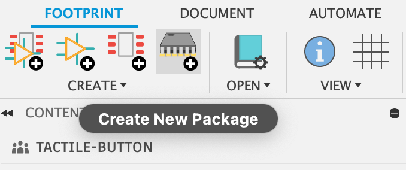
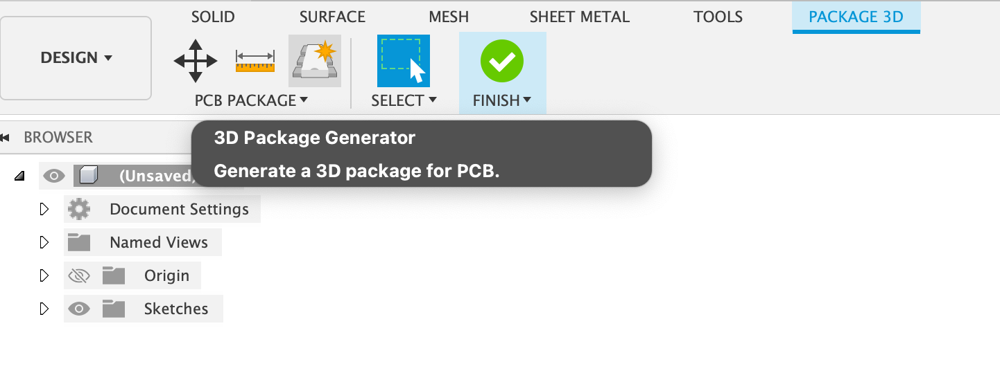
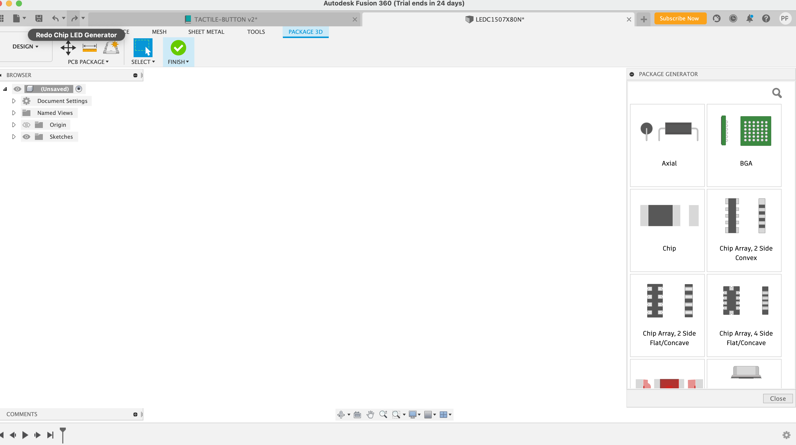
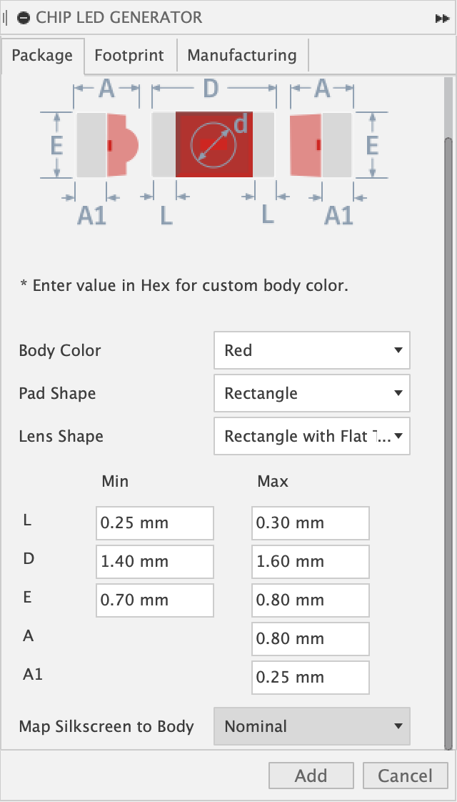
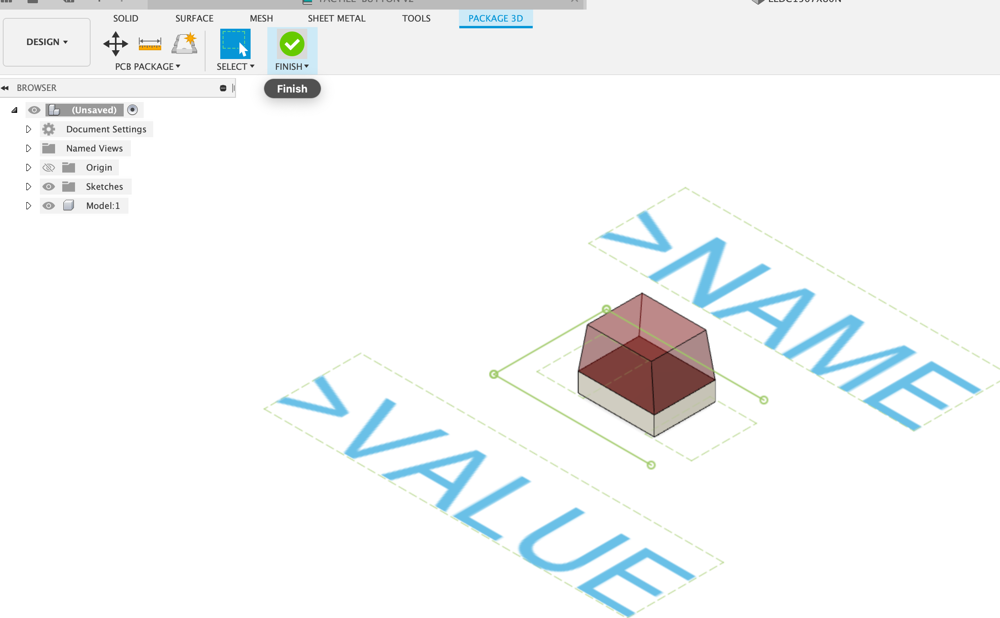
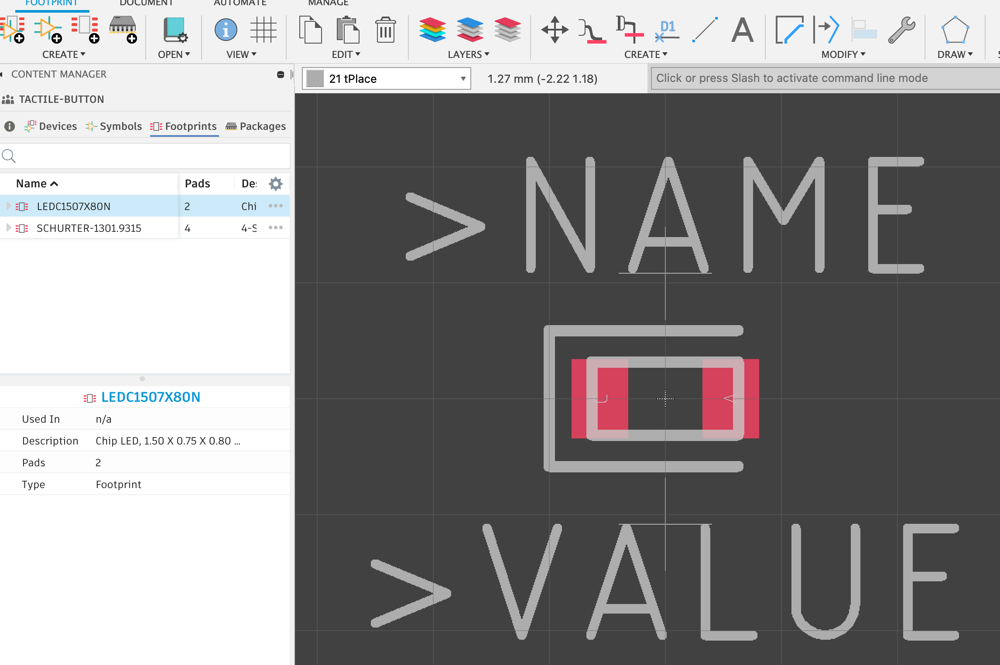

# Building Parts in Fusion360

To be completed on your own.

Check the course schedule for due date(s).

## Skills to Learn

1. Learn to use the package generator in Fusion360.
2. Learn to create more complex, footprints, devices, and schematic symbols in Fusion360.
3. Learn to interpret device datasheets to ensure that the footprints you design meet the requirements of the devices they are for.

## Equipment, Supplies, and Software You will Need

1. Fusion360
2. The starter repo: for this lab: https://classroom.github.com/a/uhf-yoXA. (Don’t clone it until the start of class, last minute changes are likely)
3. Read through the [Fusion Tricks Page](../../Fusion-Tricks.md) and skim the [Autodesk docs](https://help.autodesk.com/view/fusion360/ENU/?guid=ECD-LIBRARY-DESIGN) that go over the design tools you will use this lab.

## Preliminaries

### Make Fusion360 Easier to Use

Set your grid to mm, you can follow the instructions [here](https://knowledge.autodesk.com/support/fusion-360/learn-explore/caas/sfdcarticles/sfdcarticles/How-to-Change-Units-in-Fusion-360.html).

A sample `eagle.scr` is available in this repo under `QuadClass-Resources/Eagle/eagle.scr` It will set the grids to the correct defaults in new schematics, boards, and libraries you create.

### Units of Measure

In a perfect world we would all use mm for everything when designing our boards. Unfortunately, this not always possible. Fusion360 uses mm internally, but for some reason it wants to use ‘mils’ for some parts of its UI and inches are the default in others. In addition, by convention, Fusion360 schematic symbols are built on a 0.1” grid. And some board houses specify tolerances in mils or inches.

This means you need to pay close attention to your units. Here’s a simple reference:

- 1 in = 25.4mm
- 1 mm = 0.0387... inches
- 1 mil = 0.001 inches

In Fusion360, the safe thing to do is write it out. If you type ‘1mm’ or ‘1in’ or ‘5mil’ into a length field in a dialog box, Fusion360 will do the "right" thing (namely convert it to whatever it wants to display and show that value).

## Building Parts

Create footprints, symbols, and devices for the following electrical components. You'll add these to a newly-created (by you) `lbr/custom.lbr` in the lab repo.

| Description              | Digikey part number  | Notes                                                                                                                     |
| ------------------------ | -------------------- | ------------------------------------------------------------------------------------------------------------------------- |
| 0805 0Ohm resistor       | 311-0.0ARCT-ND       | Build resistors by hand                                                                                                   |
| Red Light emitting diode | 160-1178-1-ND        | Orientation is key   Use the package generator for the LED                                                            |
| N-Channel MOSFET         | SI2302CDS-T1-E3CT-ND | Pay close attention to the pads   Use the package generator with a custom footprint for the MOSFET (or build by hand) |
| LSM6DSOXTR 9-Axis IMU    | 497-18367-1-ND       | The package generator doesn't support this IMU, build the footprint by hand                                               |

You can find information about the part by typing the Digikey part number into google. There will be a link to the datasheet.

### Using the 3D Package Generator

Fusion360, being a 3D CAD modeling software, comes with the ability to create 3D packages illustrating your components. It also comes with a tool that will generate both 3D packages and footprints of your desired component, although you will need to edit these auto-generated footprints to meet class standards. In order to access this tool, create a new 3D package using the menu:

If the 3D package generator menu doesn't show up in your newly-opened editor, you can open it using the menu option:

A window will appear on your right:

After you select your desired part model from the list of options, you can input the dimensions from the datasheet. **Select "Nominal" for "Map silkscreen body"**:

Then your 3D model will appear! Click Finish at the top menu to close the 3D package editor and generate your footprint.

Your new footprint will now appear within your library's list of parts. **Again, make sure to double check this footprint for adherence to this class's style guide, you will get warnings/errors if you don't.**

For more information, check out [this Autodesk tutorial](https://www.youtube.com/watch?v=LlhIeRFX-N4&list=PLmA_xUT-8UlKE-U-eEqrkNEI7rd1fUnLY&index=4) for an example of how to use the tool.

### Guidelines for Building **Schematic Symbols**

When you design symbols follow these guidelines:

1. Choose a sensible name for the symbol. “Resistor” is a good name for your resistor symbol, since it can be used across all kinds of resistors. “CPU” is a bad name for the symbol for our microcontroller, since the symbol will be very specific to this particular chip, so the symbol name should reflect that.
2. For polarized parts include markings that make the polarization clear.
3. Make certain that your pins are placed with 0.1” grid settings. Failure to do so will cause you no end of pain.
4. For an IC (on anything with simple, rectangular symbol) Almost all your pins should go on the sides. The only exceptions are power pins (which can go on top), and ground pins (which can go on the bottom). Generally, inputs should go on the left and outputs on the right (this is not always easy to follow, but try).
5. Use standard symbols for components like resistors, capacitors, etc. Here are some examples: https://goo.gl/enZ0v0. You can also just google for “resistor schematic symbol” etc.
6. For two terminal, polarized devices, draw the positive terminal on the left (so it matches the footprints, see below).
7. For parts with many pins (e.g., the IMU and the microcontroller) arrange the pins on the schematic symbol thoughtfully. For instance, power and ground on the bottom or top (although they can go on the sides as well, probably near each other and probably with power above ground), and logically related pins near one another. In general it is not a good idea to mimic the physical arrangement of pins on the physical device: The physical arrangement of the pins based on engineering decisions. Your schematic symbol is about creating an easy-to-read schematic. I’ll reject designs for the IMU schematic symbol that just mimic the layout of the IMU pins.
8. Use sensible pin names that will help you connect the symbol pins and footprint pins correctly. For example, ‘1’ and ‘2’ makes sense for a resistor symbol, but “C” and “A” makes more sense for a diode. For parts with many pins (like the IMU) use names from the datasheet. The goal is to make it as easy as possible to check that you have connected things properly.
9. Sizes the symbols sensibly. Discrete components (e.g., resistors and capacitors) should be small, so they don’t take up too much space. Complex parts should be bigger to make them easy to wire up. For instance, the standard resistor symbol is 0.4x0.2 inches.
10. Include text elements with “>NAME” and “>VALUE” in layers “Names” and “Values” respectively, to show details about the parts. Only include “>VALUE” if the symbol will be used in devices that need a value (see notes below).

For the IMU, take a look at the microcontroller symbol for inspiration. It's in `quadparts_prebuilt.lbr`. It's laid out pretty nicely. It's more complex than the IMU and has more documentation on it than the IMU needs.

### Guidelines for Building **Footprints**

Each of your footprints should contain the following elements:

1. Choose a meaningful name: e.g, “0805*RESISTOR” or “0805_LED”. Using the part number your are building for makes sense if there’s only one part that is that size, but for things like resistors, there are many parts (with different colors, resistances, etc.) that are the same size and you can reuse the footprint. Therefore, a name that reflects the type of \_footprint* the part uses is appropriate (e.g., `0805_RESISTOR` is descriptive in this way).
2. Draw a box in tDocu that matches the nominal dimensions of the part. For parts with leads that extend from the part’s footprint (e.g., the MOSFET), you can draw in the leads too, if you want. tDocu doesn’t show up on the board.
3. Include a text item that displays the reference designator for the part. It should be on layer `tName` and the magic string “>NAME” is replaced with the reference designator.
4. Include a text item that displays the value of the part. It should be on layer tValues. “>VALUE” is replaced with the value. This will show up in your assembly drawing to help ensure you install the right part.
5. Drawing elements on `tKeepout` showing the area in which other part are not allowed. This should include the physical extent of the device and other other areas that need to be kept clear. See the note below about how to structure your `tKeepout` lines.
6. The text for the reference designator (which appears as '>NAME' in layer `tNames`) footprint name should be in the “vector” font and of size 0.9mm with a “ratio” of 8. This is not the default for text in the footprint editor (if you figure how to make it the default, let me know). These settings make the reference designators as small as possible while still be legible.
7. The text for the reference designator should not overlap with each other or the silkscreen for the device.
8. The text for the reference designator should be aligned to 0.1mm grid (using a 0.5mm grid is better but not always possible).
9. You should tnclude text with “>VALUE” in the the `tValues` layer if the part has a value (e.g., resistors and capacitors). Real-world designs don’t usually do this, but it makes hand assembly easier. ALl the boards for the class have values on the board. They should use the same font as the the reference designators (">NAME").
10. Add lines on `tPlace` that guide the orientation, placement, and alignment of the parts. There are many different styles to consider. Google for “Resistor silkscreen” etc. for inspiration. Follow these guidelines:
    1. For polarized components, draw with the positive terminal on the left.
    2. For polarized components, make the positive terminal the first terminal.
    3. For polarized components, clearly mark the distinguished terminal with a dot or extra line. The distinguished terminal is the one that is marked in some way on the actual device, so you can oriente the mark on the device with mark on the board.
    4. When it makes sense, use familiar symbols to represent polarity (e.g., for a diode, you could use an triangle pointed toward the cathode). Design your footprint so that at least one polarity marker is visible when the part is installed (i.e. make sure all the polarity markers are not covered by the part.)
11. Make sure that the “>NAME” doesn’t overlap with the elements that show the orientation, placement, and alignment of the parts.
12. Make sure pads and SMDs are of uniform size, unless there’s an good reason not to.
13. Make sure pads and SMDs are aligned vertically and horizontally in rows and columns as makes sense for the footprint.
14. We may be soldering by hand, so you need to make sure the SMDs extend out from under the part. The SMDs should extend 0.5mm away from the edge of the footprint, except for the IMU.
15. Include lines or symbols in `tPlace` to guide placement of the part. For parts like the IMU and MCU, this should make easy to precisely place the part by showing the correct, precise location of all four corners. For other parts an outine (or partial outline is sufficient).
16. Fusion360 includes a package generator (access it via the "new" button in the device window and select "Create with package generator"). You are welcome to use it, but the footprint it generates do not meet all of our requirements. You'll need to edit them a bit.

#### The Courtyard and tKeepout

One of the goals of a good library is to make it easy to make sure your board looks good, is easy to assemble, and easy to verify. Part placement is a key part of all three, and the "courtyard" is the key to guiding how you place parts. The courtyard defines the area of the PCB that the part occupies. This includes the part physically and it's pads, but also include some extra space that makes it possible to place the part on the board. The size of the courtyard depends on how the board will be assembled. In our case, it's by hand, so we need a pretty big courtyard. I should suggest having the courtyard extend at least 1mm beyond the boundary of the part and its pads.

Fusion360 use `tKeepout` to describe the courtyard. The rule is that if `tKeepout` for different parts overlap, it is an error that will be flagged during DRC. Unfortunately, this means that if you draw your courtyard on a consistent grid (which you should), then when two parts are perfectly placed next to eachother, the `tKeepout` defining their courtyards will overlap. There are two bad options: move the parts farther apart (which takes up space) or tolerate the DRC error (which will increase the possibility that you ignore real errors).

The third, preferable, option is to draw your courtyard on 0.5mm grid and then 'inset' them by 0.1mm. This will let you place parts close together without generating suprious DRC errors. The resulting board layouts are very tidy.

The width of your `tKeepout` lines should be 0.05mm.

Note that the courtyard should not surround the `>NAME` and `>VALUE`. Two reasons:

1.  You'll probably end up moving the reference designators around (which you can do freely on the board layout)
2.  You'll have to pack parts together more closely than such a large courtyard will allow. The result will be that you'll ignore a bunch of DRC errors and end up having to manually enforce reasonable spacing between parts.

### Guidelines for Building Devices

Devices connect footprints to schematic symbols and provide information necessary to purchase and install an eletronic component.

Follow these guidelines when creating devices:

1. The device should have a generic name, if it will have many variants. For instance, a “Resistor” or “Capacitor” device will have variants for different footprint sizes and values.
2. Put the symbol at the origin (in the left-hand pane of the device editing window)
3. Choose a sensible name for the device. The guidelines for symbols generally apply here as well.
4. When you create variants in the device, give them descriptive names. For instance, for 10Ohm, 0805 resistor, “-100R-0805” would be good name. Avoid having an unnamed variant unless there is really only ever going to be one variant.
5. Be selective about what information you put in the variant name. The size, value (resistance, capacitance, color, etc.), is a good idea. You should only include information that will be useful to you when selecting which variant to use.
6. Make sure to connect the symbol pins to footprint pins correctly. Check it, check it again, have your partner check it. This is a common source of hard-to-find bugs.
7. Set the “Value” radio button appropriately. Things like resistors and capacitors naturally have a value (i.e., a resistance or a capacitance), others, like the microcontroller, do not. If you set the value radio button, your schematic symbol should include ">VALUE" in layer `Values`.
8. Set the prefix appropriately: “R” for resistor, “Q” for mosfets, “U” for ICs, “D” for diodes, etc. This is what Fusion360 will start the reference designator with (e.g., “R1”, “Q2”).

You should have one variant for each different physical device you might include in your design. For instance, if you have two 0805 resistors with different resistances, you should one variant for each of them. In this case, you should add an attribute (see below) called “VALUE” that specifies the value (e.g., “10R” for 10 Ohms, “1nF” for 1 nanofarad).

You can attach metadata to each variant of your device using "attributes." (Fusion360 provides the notion of "technologies" which are different sets of attributes for a device. You should always use the unnamed technology: "") All your variants should have the following attributes:

- `DIST` – distributer (For us, this is always “Digikey”)
- `DISTPN` – Distributer part number. i.e., Digikey’s part number. This is different from the manufacturer’s part number.
- `CREATOR` – Your name, if you designed the part.

All these attributes should be “constant” which means you can’t change them on a per-part basis in the schematic. Set this via the drop down in the attribute editor window.

`DIST` and `DISTPN` are especially critical, because when we go to order parts for your quadcopter, we will use this information to know what to order.

### Notes on Individual Parts

The data sheets for all the parts are in `QuadClass-Resources/Datasheets`.

#### Resistor

- Include “RES” in the name of the device you create, so Eaglint can find it.
- Check the `resistor_mounting_PYu-R_Mount_10.pdf` for guidance about the footprint, but...
- Make sure SMDs extend 0.5 mm beyond the end of the resistor.
- The prefix for your resistor device should be “R” for resistor.
- Name the variant so it’s clear it’s a 0 Ohm resistor. Something like “-0Ohm” or "-0805-OOhm" would make sense.

#### LEDs

- When generating the 3D package, choose "Chip LED" as your model.
- Include “LED” in the name of the device you create (so Eaglint can find them).
- The prefix for your LED device should be “D” for diode.
- Positive terminal on the left on both symbol and footprint.
- Name the cathode ‘C’ and the anode ‘A’ on both the symbol and the footprint.
- Make sure SMDs extend 0.5 mm beyond the end of the LED.
- Name the variant so it’s clear it’s a red LED (it is a red LED because it has the DISTPN that corresponds to a red LED)
- In your footprint, mark the SMD that connects to 'distinguished' pin of the physical device (see below).

Any physical part for which orientation (or polarity) is important will have some marking on it that distinguishes one terminal from the others. On the IMU or the microcontroller or the IMU, this is a dot near pin 1. For tiny devices like LEDs, it'll be some kind of mark. For this LED it is two green rectangle drawn on the top of the LED under the plastic 'lens' that forms the top of the LED. You can see them drawn on the mechanical drawing in the data sheet.

Your footprint should include some kind of marking that marks the SMD that should attach to the distinguished pin. Is the distinguished pin the cathode or the anode?

#### MOSFET

- When generating the 3D package, choose "SOTFL" or "SOT23" as the model.
- Include “FET” in the name of the device you create.
- The prefix for your MOSFET device should be “Q” (that’s the conventional prefix for transistors).
- Since we are using an NMOSFET (as opposed to a PMOSFET), current flows from the drain to source, so put the drain on top in the symbol.
- Name the source, drain, and gate, “S”, “D”, and “G”, respectively in both the symbol and the footprint.
- Read the section in the datasheet about SMD layout starting on page 6 (make sure your looking at the datasheet provided in the "Resources" git repo. The datasheet online is missing this page).
  - There are two aspects of SMD sizing you must address in this footprint. The first is the size of the metal SMD. The second is the hole in the solder mask, called the “stop mask” because it stops the solder mask. Normally, SMDs come with appropriate ‘stop’ by default. You’ll need to remove the default stop and add yours by hand.
  - Create the SMDs according to the guidance in the datasheet.
  - Use the info tool to edit each SMD, and uncheck ‘stop’.
  - Draw in the stop by hand in layer `tStop` with the rectangle tool. The geometry of these rectangles should correspond to the “recommended minimum pads” in the datasheet.
  - You will need to draw in rectangle on `tCream` as well (and disable the "Cream" check box in properties dialog). Your `tCream` can (and should) be identical to your `tStop`. `tCream` specifies where solder paste will be applied during assembly.

#### IMU

The IMU has caused us significant problems in the past. Be careful with it. You should read both the datasheet and the SMD tech note (look for `IMU_*` in `QuadClass-Resources/Datasheets`).

- Use the footprint reference we created for the IMU `QuadClass-Resources/Datasheets/IMU_LSM6DSOX_Dimensions.pdf` to create the footprint. Use same orientation.
- There should be no metal under the IMU. To enforce this, you should do the following
  1.  Draw a rectangle in `tRestrict` that fills most of the space in under the footprint, but does not overlap any of the pins.
  2.  Draw a rectangle in `bRestrict` that covers the entire footprint.
  3.  Draw a rectangle in `vRestrict` that covers the entire footprint.
- ~~There should be no solder mask under the middle of IMU. To enforce this, draw a rectangle of `tStop` that covers the area under the footprint, but does not overlap the pins.~~
- Include “IMU” in the name of the device you create.
- You should compute the SMD width based on the IMU datasheet and the `Datasheets/IMU_Soldering\ guidance-{1,2}.pdf` documents. You will need to read them quite carefully.
- The prefix for your IMU device should be “U” (that’s the conventional prefix for ICs).
- Label the SMDs on the IMU using either the pin numbers or the names used in the datasheet. Some pads same replicated names. Use something like “GND1”, “GND2”, etc. to distinguish them.
- Be sure to include a pin-1 indicator that will be visible when the IMU is installed.
- There are a bunch notes in the technical notes about soldering guidance that say to not solder the pin-1 indicator. Our IMU does not have the kind of pin-1 indicator they are referring to, so that guidance does not apply.
- ~~You will note that it appears that there will be no solder mask between the pads because the `tStop` for the pads overlap. The width of the automatically added `tStop` is controlled by the `.dru` file we use during board layout and our DRU file will ensure that solder mask remains. However, the DRU file doesn't affect how the `tStop` appears in the footprint editor.~~

## Turn in Your Work

### Commit the following:

1. Your `lbr/custom.lbr`
2. Submit it though Eaglint: http://eaglint.nvsl.io.

### Rubric

“Perfect” score: 10

Initial points: 12

You will lose 0.5 points for failed full design check or human review and 1 point for each day late.
