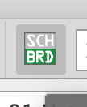
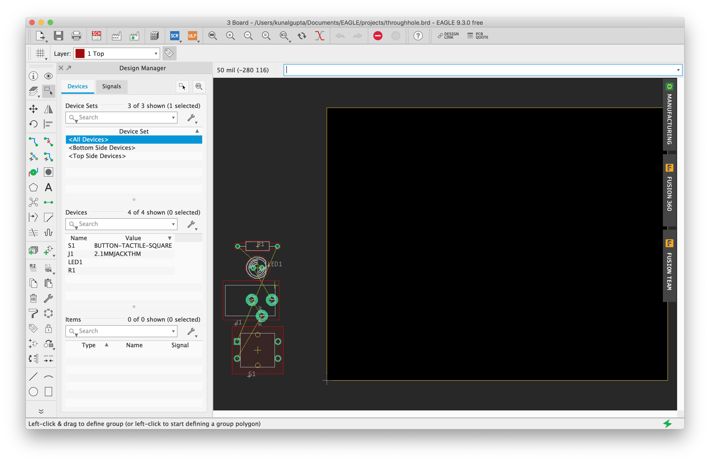
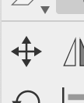
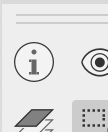
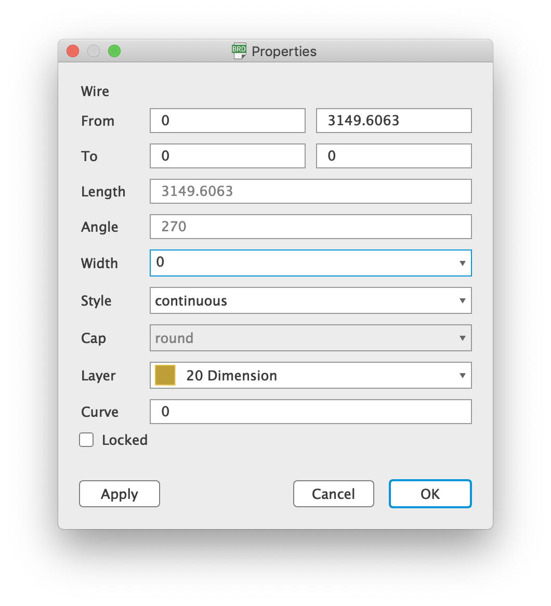
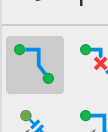
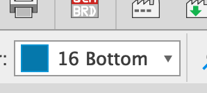
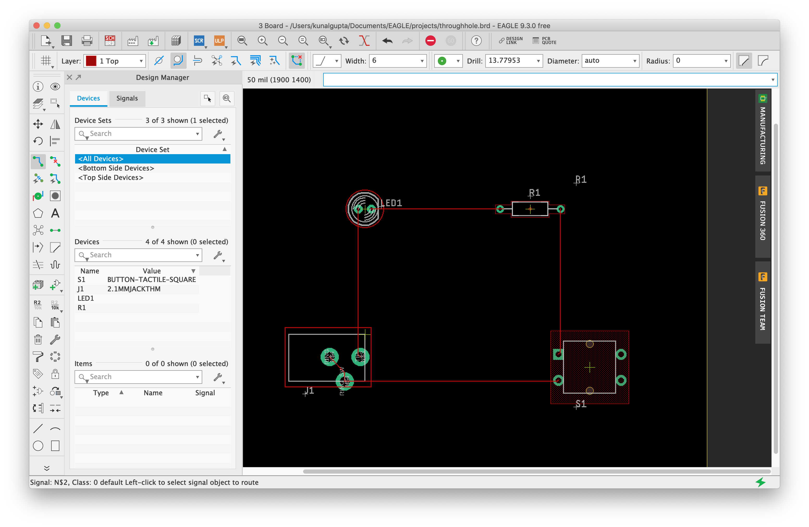
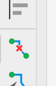

# Creating the Board in Eagle

The next step is to generate the board, place the parts on it, and to connect them with wires.

The course style guidelines for board layout are in the "Board Layout Style Guide" section of section of https://github.com/NVSL/QuadClass-Resources/tree/master/labs/Laying-Out-The-Board.  Read and follow them.  Eaglint will complain if you don't.

## Auto-generate the board

To do this, click the "Generate/switch to board" icon near the top of the Eagle schematic editor

And click "OK" if a dialog box appears. You should now see the Eagle board editor window. Eagle has automatically created a board for you and named it "throughhole.brd." Select "View->Zoom out" a couple time so you can see everything. You should see a black rectangle and a collection of shapes to its left. Those shapes will each correspond to one of the devices in your schematic:

In my window, the resistor is on top, followed by the LED, power jack and the button.

## Placing the devices

The black box is the board outline, which means that none of the devices are actually on the board. We can move the devices with "move" tool.

Select it and then use it drag the devices around until you like the positions. You can use the rotate tool to rotate the devices as you like. You should also adjust the board outline so that fits somewhat snugly around the devices. The easiest way to adjust the board outline is by using the move tool to move the edges of the rectangle. You should also zoom in a bit so you can see what's going on:

The green rings are called "pads" and they correspond to the pins in the schematic.

## Preparing the Board Outline

The default board outline that Eagle provides is the maximum size of a board that the free version of Eagle can handle. It's there as a guide. Since its just a guide, the line that makes up the outline has a width of zero. This means it won't have any effect on the design once its manufactured.

To fix this, we need to change its thickness. Do this with the "info" tool:

Select the tool and click on one of the lines. A "Properties" window will appear:

Change "width" to 0.01. Click OK and repeat for the other three sides of the board outline. The board outline should now be noticeably thicker.

The “Info” tool is a critical part of Eagle. You can use it to query and change information about all aspects of your design.

## Routing the board

The devices are placed on the board, but there are no wires (or “traces”) connecting them. The yellow lines you see correspond to the electrical connections in the schematic, but they do not correspond to an actual piece of metal yet.

To convert these logical wires into physical traces, we use the “route” tool (you may need to expand the board editing window a bit to see all the tools in the palette):

This tool lets you draw wires or traces on the board. The traces can be on either top or bottom of the board. We want ours on the top, so we need to make sure we are routing the traces in the top layer. You can control which layer you are working in with the layers drop-down menu in the upper left of the PCB editor window:

The screenshot above shows that layer 16 is selected. This corresponds to traces on the bottom of the board. Use the menu to select layer “1 Top”. It should show up as red instead of blue.

Select it and then click on one of the yellow lines. It will turn into thicker, red line. You can click to add corners, and you need to add segments so that the two pins the yellow line connected are connected with the blue line. You also need to make sure that the traces don’t touch each other or touch pads that they should not be connected to. You are done routing the board, when there are no more yellow lines and all the pads are properly connected:

If you make a mistake while routing you can either undo the action from the Edit menu or use the “ripup” up tool to unroute a trace:

You now have a routed board!

## Running DRC

Once you have a board the way you want it, need to run the design rule check (DRC) to help ensure that board can be manufactured. The rules for DRC vary from manufacturer to manufacturer. They include things like how narrow a wire can be and close a drilled hole can be to the edge of the board.

To start DRC select “Tools->DRC…” and then click “Load.” Navigate to select “EAGLE/DRU/4pcb-33board.dru” in your copy of the git QuadClass-Resources-master repository. Then click “Check.”

A window should open showing a list of errors.

The illustrations that follow use a more complex board that actually has DRC errors, rather than our simple flashlight board. If the window doesn’t appear, select “Tools->Errors”. Each of the entries in the list represents a violation of the design rules.

Selecting one will highlight it in the board layout window.

The black box shows where the error occurred and the black line from the upper left corner of the window is just to help you find the black box.

The error names are cryptic, but there’s an explanation for each of them in the Eagle Manual (it’s part of your eagle installation and called “manual_en.pdf”) on page 169. For instance, the error shown in the window above is a “Restrict” error which means there is some top or bottom copper in a region marked in the t/bRestrict layer (more on layers later). Another common error is “Stop mask” which usually means you have silkscreen running over a pad.

Whether these errors are actually worrisome is sometimes hard to determine. For instance, “Stop mask” errors don’t seem to actually hurt anything because the board houses will just not print the silkscreen on the pad.

If you find an error that is spurious, you can click the “Approve” button and the Eagle won’t bother you about it any longer. Be careful, though, if you approve an error that’s actually an error it may negatively affect your design.

For DRC errors that you want to fix, it is not always clear how to remedy the problem. For “Restrict” errors and some other involving routing, you can reroute some traces to get rid of the problem.

If you have DRC errors you don’t know how to fix, please talk to the professor or the TA.
