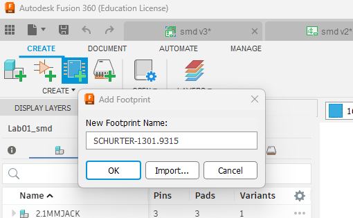
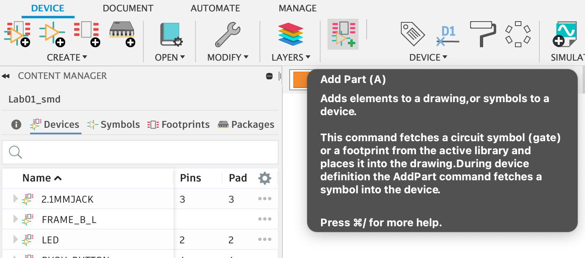
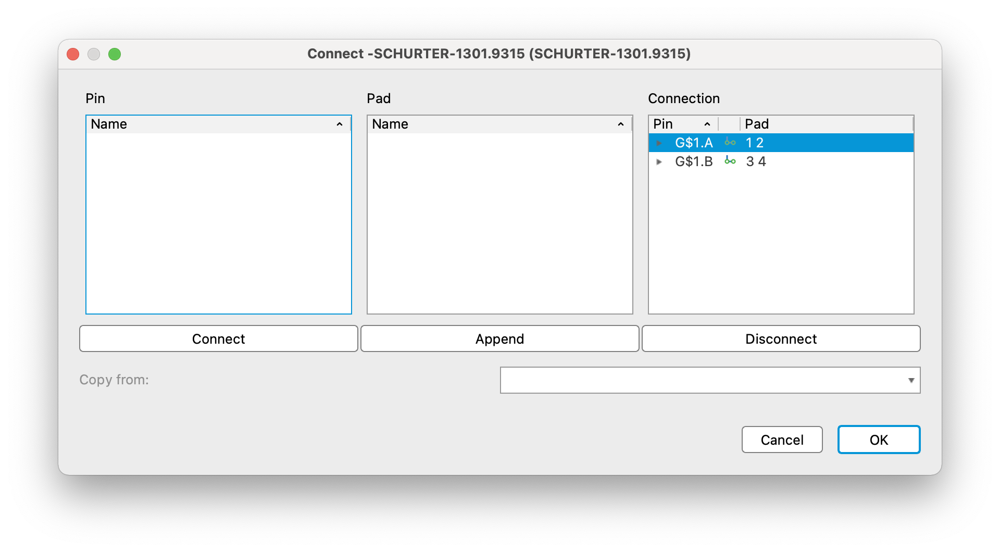
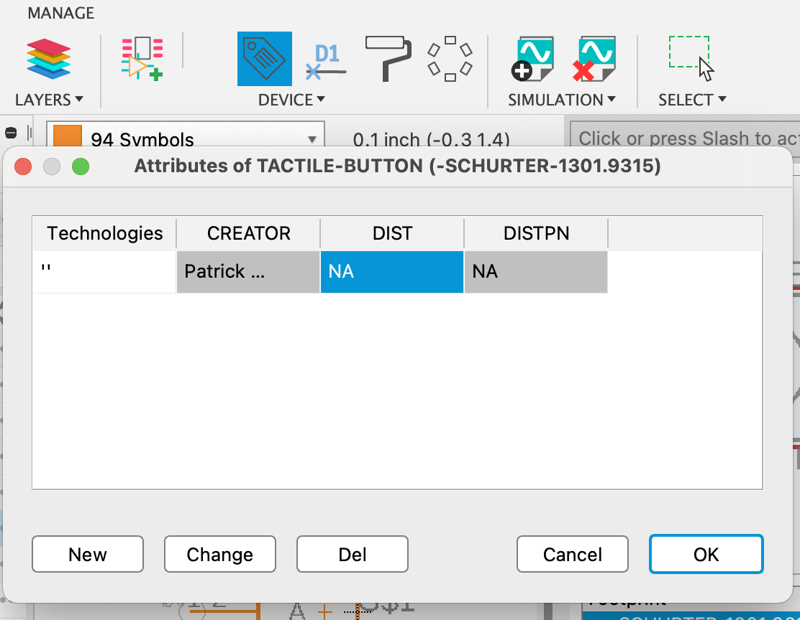
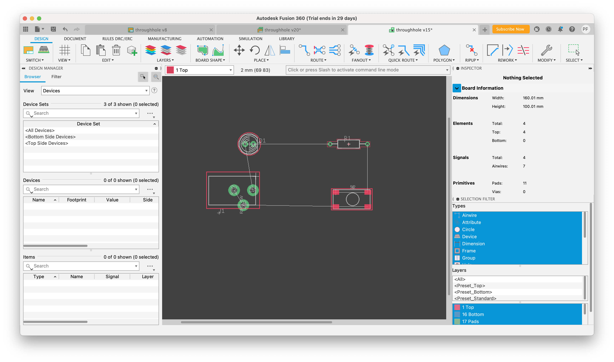

# Part 4: Creating Surface Mount Components

The design we have so far for the flashlight uses "through hole" parts. This means that the pins for the part protrude through the board and are soldered into place by filling the hole with solder. Through hole parts are easy to work with, but they are bulky and drill so many holes through the board makes it harder to route more complex boards since the parts effectively occupy space on all the layers of the board (front, back, and any internal wiring layers).

Most modern PCBs use "surface mount" (also called SMD) parts that more compact and only require connections to one side of the board. They are also harder to solder. Many of the components we will use are only available as surface mount, and many components are available as both surface mount and through hole.

The course style guidelines for libraries are in the "Guidelines for Building..." section of [this lab](https://github.com/NVSL/QuadClass-Resources/blob/master/labs/Building-Parts-In-Eagle/README.md). Read and follow them. Eaglint will complain if you don't.

## Preparation

Create a new schematic and board files named `smd.sch` and `smd.brd` and load the DRU file for error checking. Remember for creating a new design `File->New Electronics Design` and save the design as `smd`. Then in the design tab `Create->New Schematic` and save the schematic as `smd`. Then in the design tab `Create->New Board` or in the schematic tab `Switch to PCB document`. Add the same components, with the exception of the through-hole button. You can add the components into the schematic manually. However, if you are a desperate person as me, instead of adding the components again manually you can copy the entire schematic by going to the throughhole schematic tab, then clicking `Group Select` and selecting all components including the FRAME, then Ctr+C, then switch to the smd.sch tab and Ctr+V. Finally, delete the through hole button. The tabs and smd schematic should look as follows:

This time instead of adding the button component from a library we will create our own surface mount component inside a library. We will create part number [1301.9315](https://www.digikey.com/en/products/detail/schurter-inc/1301-9315/2643952) which has the following [datasheet](https://www.schurter.com/en/datasheet/typ_6x6_mm_tact_switches.pdf). It's the one that looks like this:

In datasheets is common that manufacturers show many dimensions for different versions for the same family of components. Also they show two types of dimensions, the physical component dimensions and the PCB pads recomended dimensions. We will use the dimensions **of the recommended PCB pads** which in the datasheet corresponding to the `LSH Gullwing lead` version:

If you can't access the datasheet for the SMD button please ask the TA.

## Creating a Surface Mount Component

All electronic components are stored inside libraries (\*.lbr files), and include schematic symbols, PCB footprints, and 3D packages. Now, Adafruit has a very nice [tutorial about building new schematic symbols, packages, and devices in Eagle](https://www.google.com/url?q=https%3A%2F%2Flearn.adafruit.com%2Fktowns-ultimate-creating-parts-in-eagle-tutorial%2Fintroduction&sa=D&sntz=1&usg=AFQjCNGsUFLtnS_nmz4ra63XcImFHoVf9A). However, since this tutorial's release, Eagle has been ported over to Fusion360. Autodesk has released several tutorials on how to design custom parts, which can be found [here (~15 min)](https://www.youtube.com/watch?v=zqar0XWtFaY) and [here (~45 min)](https://www.youtube.com/watch?v=xNIEXCimRSg&list=PLmA_xUT-8UlKE-U-eEqrkNEI7rd1fUnLY).

We will go step by step creating the SMD button component. However, it's recommended that you go through any of the above tutorials for further reference. We recommend the more recent ones from Autodesk.

Go to your Github repo and make a copy of `Lab01.lbr` called `Lab01_smd.lbr`, we will create the SMD button there.

Open `Lab01_smd.lbr` in Fusion360. `File->Open...->Open from my computer->Lab01_smd.lbr`, you should be able to see a screen as the following:

## Create a new Footprint

The footprint refers to the PCB pads (exposed cooper) where the SMD button legs will be soldered into the PCB. Click `Create New Footprint` and give it the name of `SCHURTER-1301.9315`.

Change the Grid to `0.25 mm`. For footprints it's recommended to use the grid that makes sense to crate the dimensions for the SMD button pads shown in the datasheet.

Now it's time to add the SMD button pads. Click `SMD pad` and place the pad in X,Y position `[-5.00 -2.25]`. On the top center you can see the position of your cursor with the pad. By default, for placing pads the center of the pad is taken as reference.

Why that position? Remember, we are trying to recreate the same pads with the same dimensions shown in the SMD button datasheet. So if the pads require a Y spacing of 10.00 mm, 10.00/2 is 5.00 mm. Same for X spacing, 4.5/2 equals 2.25 mm. **Taking as reference the center**, the first pad (down left) should be placed at -5.00 mm, 2.25 mm. That's also why we set the grid to be 0.25 mm, so we can have a precision of 0.25 mm.

Add 3 more pads in the X,Y positions: `[5.00, -2.25]`, `[-5.00, 2.25]`, `[5.00, 2.25]`. The final result should look like this:

We are missing the pads dimensions which, taking as reference the datasheet, are `2.10 mm X 1.40 mm` for each pad. Use the Info button to correct the size for each pad.

All pads need to have a name, which is used to know the orientation of the component and to make the right connections within the component. Use the reference below pads dimensions in the datasheet to number the pads.

⚠️ I'm serious! Pay attention to the naming, naming the pads wrong can make you, for example, connect pads 1 with 3 and 2 with 4, which is a short (button always pressed). This error has happened to me before for not paying attention, and you can only figure the error out after the board has been assembled.

#### Creating a Footprint

Footprint editing in Fusion360 is similar to what is detailed in the Package section of the Adafruit tutorial. The important tools you need have all been added to the toolbar at the top of the screen, and should you be unable to find a particular tool you can always use the command line. For more information on editing a footprint in Fusion360 check out [this video](https://www.youtube.com/watch?v=8-tJZHFzWXo&list=PLmA_xUT-8UlKE-U-eEqrkNEI7rd1fUnLY&index=3).

To add a footprint to a device, click on the device in the library editor, select `New->Local Package` and locate your footprint in the list. (The footprint in this screenshot has several style errors, your footprint will look different)

#### Creating a Symbol

Symbol editing in Fusion360 is mostly the same as what is detailed in the Adafruit tutorial, and just like the footprint, the crucial tools are in the header. However, once you have finished creating your symbol, connecting it to the device is a little different. If you go back to the library editor and examine the device, you should find that you can add a part to the symbol layer on the left. Locate the symbol you just created to add it to the device!

#### Creating a Component

The device editor, just like the other steps have mostly gotten a cosmetic refresh. Important buttons are outlined above and below, and otherwise the Adafruit tutorial is good to go through for final steps!

### Reading Datasheets

Interpreting datasheets takes some practice. Here are some tips:

- The datasheet includes data on many switches. Make sure you are looking at the correct part of the sheet.
- There are several mechanical drawings. For creating a footprint, you are interested in solder pad layout (in the "Drilling diagrams" section, since most of the drawings are for throughhole parts).
- Don't assume drawings are for scale. Instead, use the numerical values given.

###

## Additional Requirements for Your Footprint

The footprint should be called `SCHURTER-1301.9315`, the symbol should be called `TACTILE-BUTTON`, and the component should be called `TACTILE-BUTTON`, and the variant should be called `SCHURTER-1301.9315`.

Name the pins to match the PCB layout drawing in the data sheet, and orient your footprint to match the drawing as well. This is a good practice because it makes it easy to see that your footprint matches the drawing.

Make sure that the length of your smds in the long dimension, and the width is the shorter dimension.

###

### Additional Requirements for Your Symbol

Your symbol should have just two pins (whereas the symbol you used in your throughhole schematic had 4). They should be called `A` and `B`, and pressing the button should connect them electrically.

Note that your footprint has four SMDs. You'll need to connect two SMDs from the footprint to a single pin in symbol. You do this in the "Connect" dialog. Just select one pin and two pads, and click connect.

###

## Additional Requirements for Your Device

There are a few other things you'll need to be sure of in the footprint you build:

- You need two add three "attributes" to the new variant you created, which can be edited using the `Attribute` button on the device screen (see below screenshot):

  - "CREATOR" This should be your name, since you created the variant.
  - "DIST" for distributer. This is where we buy the part from. You can put "NA"
  - "DISTPN" for distributor part number. You can put "NA"
  - You can add attributes by clicking on "attributes" in the device editor window:

- You also need to be sure to draw a box around your footprint in layer ‘tKeepout’.
- You need to add a text item in layer “tName” that contains “>NAME”. This will be replaced with the parts name. To render clearly, the next needs to be at least 0.9 mm high, have a weight of 8% and be in the “vector” font. You can set these parameters in the tool bar at the top of the window or by using the “info” tool to change the attributes of the text after you create it.

##

## Replacing the Through-hole Component

You can use your new SMD button just like our own through-hole button. Just delete the old button and replace it with your new button.

##

## Fixing up the Board

Since you just changed the footprint for the button, the board will need to be updated. Traces will probably be crossed, etc.:

To fix this, we’ll rip up all the old traces and reroute the board. Use the “group” tool: To select everything on the board.

Next, select the `Ripup` tool. Everything will appear to be deselected, that’s ok. Now, right-click on the board, and select “Ripup: Group”. All of the routed traces will disappear:

Now, re-route the board, but now using the `Autorouter` tool:

which will result in a nice, fully-routed board!

## Re-running the CAM Processor

Follow the instructions for running the CAM processor given above. In the Gerber viewer, you can find the pads for the SMD button the in the GTL layer. If you check the GBL layer, you’ll notice that while the pins for all the through hole parts appear on the bottom of the board, the pads for the surface mounted component does not.

Once you've done everything, you're ready for the [final steps](README.md#getting-art-onto-the-board): adding artwork and exporting!
