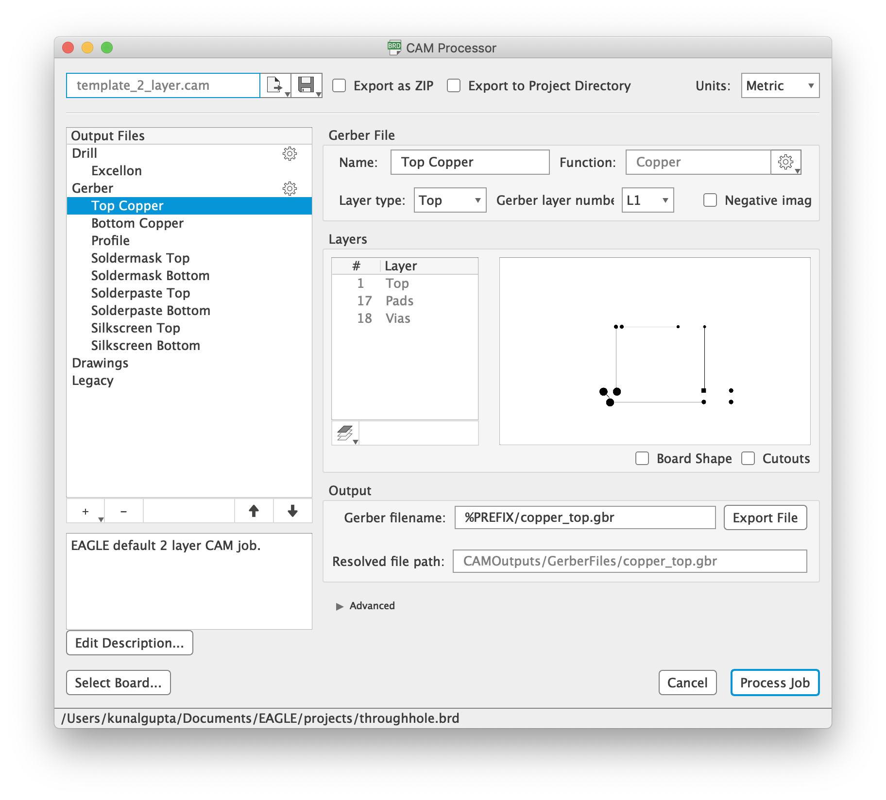
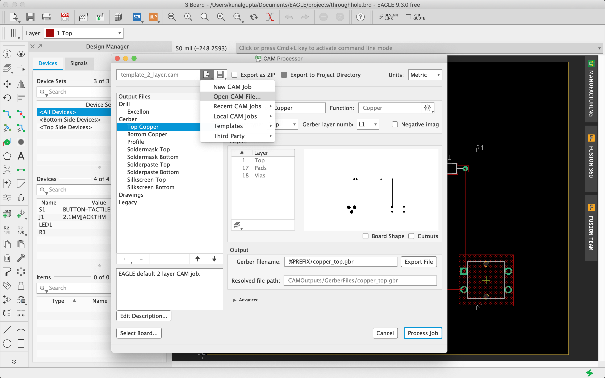

# Part 3: Preparing the Board for Manufacturing

Once the design is finished, we need to translate it a format that the manufacturer can understand.

## Generating the CAM files
In order to have a board manufactured an Eagle file is not sufficient. Instead, you need to produce a set of computer aided manufacturing (CAM) files for the design. Eagle provides a tool called the "CAM processor" to generate these files for your design. CAM files are also called "Gerber files."

Different board manufacturers (i.e., "board houses") require different types of CAM files and some require different CAM setups for different levels of board complexity. We will be using https://jlcpcb.com/capabilities/Capabilities, a Chinese manufacturer that is pretty reliable and fast. Each board house and service level has different sets of restrictions the design must meet and, potentially, a different set of design files they require. Two files define how Eagle interacts with the board manufacturing process.

The first is the .cam file. This defines the set of gerber files we will send to the manufacturer. The second in the .dru file that defines the design rules for the board house. The specs for JLCPCB's PCBs are here: https://jlcpcb.com/capabilities/Capabilities. Eagle uses the design file to, for instance, guide the autorouter and perform sanity checks on our design.

The DRU and CAM files you need for this lab are in `Eagle/CAM/jlcpcb-2layer-eagle9.cam` and `Eagle/CAM/jlcpcb-4layer-eagle9.cam`.

<!--
To select the CAM file you will use, select "Window->Control Panel" Then select "File->Open->Cam Job..." and navigate to Eagle/CAM/jlcpcb-2layer-eagle9.cam.
You should see a window like this:

Leave this window open and return to the board editor window. 
-->
To select the CAM file, return to the board editor window, select "File->CAM Processor..." a window will appear like this:
<!--
the same window will reappear but with some additional information filled in:
-->

Then click on the "load job -> Open Cam File". This will allow you to select the required CAM file. 

The tabs on the left correspond to the CAM files that the CAM processor will generate for this design. The body of the window contains configuration parameters for each of the CAM files. Don't touch any of these settings.

Click "Process Job". A progress bar will appear briefly and then vanish. The CAM files have been generated, and are now in the same directory as your schematic and board files.

## Viewing the CAM files
Eagle cannot open or view CAM/Gerber files. For that you need a Gerber viewer:

* Mac: I like Cuprum: http://www.wortum.com/cuprum/.
* Windows: http://www.viewplot.com/
* Linux: http://gerbv.geda-project.org/ (It might already be installed. Or do `sudo apt-get install gerbv`)

The instructions below are for the Cuprum viewer on a Mac.

Launch Cuprum and create a new project (Command-N). Click "Import..." and then select all the files generated by the CAM file generator. These are:

* `throughhole.cmp`: This is the copper on the top layer of the board. You should see metal traces corresponding to the routed traces you added in Eagle. You should also see a circle at each pad.
* `throughhole.stc`: This is the solder mask for the top of the board. Solder mask is the green material that covers the surface of the board. It protects the metal from corrosion and accidental electrical connections. This layer is a negative. It shows holes that will appear in the solder mask, exposing the parts of the copper that we need to make connections to. There should be a circle around each of the pads.
* `throughhole.plc`: The silkscreen layer contains the write documentation and markings that appear on the surface of the board. It should contain the outlines of the parts and their reference designators (e.g., "LED1").
* `throughhole.sol:` Bottom metal layer.
* `throughhole.sts`: Just like `stc`, but for the bottom of the board.
* `throughhole.pls`: Just like `plc', but for the bottom of the board.
* `throughhole.ncd`: This is the drill file. It determines where holes will be drilled in the board. There is one hole for each of the pads in our design. There would also be pads for Vias and “mechanical holes” for mounting etc. Unfortunately, the format the Seeed requires for the drill file does not display well in the gerber viewer, so the holes will be all over the place.

Load them, and then examine each by toggling its visibility in the viewer:

3. Make sure the File name matches the File Content. You will probably need to change the File Content for the *.drd to *NC Drill.*
