# Introduction to Fusion360

To be completed on your own. Time is especially short for this lab, please try to work through it before the first day of class.

Check the course schedule for due date(s).

Skills to Learn

1. How to complete the Envision Maker Studio Responsibility Contract.
2. GitHub basics.
3. Installing Fusion360.
4. Creating a schematic in Fusion360.
5. Generating a board from a schematic.
6. Designing packages in Fusion360.
7. Designing symbols in Fusion360.
8. Connecting packages and symbols using devices.
9. Modifying an existing schematic.
10. Incorporating new devices into a design.
11. Defining new layers.
12. Adding graphics to a PCB design.

## Equipment, Supplies, and Software You Will Need 

1. A computer with Fusion360 installed (either in the Maker Studio, the basement CSE labs, or your own laptop). Fusion360 is available on all platforms!
2. The [starter repo](https://classroom.github.com/a/8NsKPNlT) for this lab (Don't clone it until the start of class, last minute changes are likely).
3. The contents of the class materials Github repo: https://github.com/NVSL/QuadClass-Resources

## Tasks to Perform

### Complete the Responsibility Contract

Go to http://makerspace.ucsd.edu/access/responsibility.php and follow the instructions. Print the completion page (it says something like "YOU PASSED!") to a pdf called `responsibility.pdf,` commit it to your repo. 

### Fill Out The Self Evaluation

Login to your __@ucsd.edu__ gmail account and fill out [this survey](https://forms.gle/a6yFoNri79w6TF796).  You will receive
a copy of your responses via email.  Print it to a pdf and include it in your repo as `survey.pdf`.

### Get set up on GitHub

We are going to use GitHub classroom for this course. You'll need to [create a GitHub account](https://github.com/), if you don't already have one. For each part of the project, there will be an assignment setup on GitHub. You and your teammates will commit your work to the repo in order to turn it in.

First, you'll need to authorize GitHub Classroom to access your GitHub account. To do that, visit https://classroom.github.com and sign in with your GitHub account.

Then click on the link for the starter repo listed in the [Equipment, Supplies & Software](#equipment-supplies-and-software-you-will-need) section above.

We will be using GitHub a lot in class. If you aren't familiar with it, there are a bunch of good introductory tutorials. For example, [this one](http://try.github.io/). Signing up for the [GitHub Student Development Pack](https://education.github.com/pack) is also recommended so that you can get GitHub Pro features.

### Install Autodesk Fusion360

Install Fusion360 by following [this link](https://www.autodesk.com/education/edu-software/overview) to find the list of Autodesk software available to students. Click the "Get Started" button on the Fusion360 card and follow the prompts in order to verify your education status. If you are creating a new account, be sure to use your __@ucsd__ email to make verification quick.

Once you have verified your education status, return to the software list and find the Fusion360 card to download and install the program.

### Fusion360 Teams

When first starting up Fusion360, you may be greeted with a window about forming teams. Fusion360 is able to manage shared versions of designs in the cloud, and the way that multiple people access a particular design is through a team. However, in this lab we will not be using teams, and in general we will not have a team for the entire class, so go ahead and create a new team with whatever name you prefer. In future labs, you and your partner are welcome to take advantage of this feature to manage shared copies of your board design!

### Make Fusion360 Easier to Use

By default, Fusion360 comes configured with a bunch of libraries that can make it hard to find the libraries we are using for this class. This is controlled the directories Fusion360 is setup to look in for library and other files. You can change the directories by selecting `User->Preferences` (upper-right corner) and the selecting `General->Electronics->Directory`. The window should look something like this:

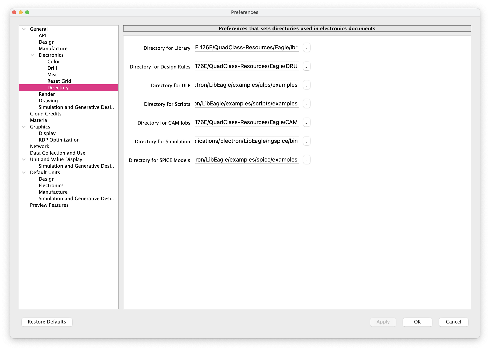

You can update these paths by simply clicking the `.` button to the right of the paths. I suggest the following settings:

* Libraries: `<path to>/eagle-intro-wi22-<gitusername>/lbr`
* Design Rules: `<path to>/QuadClass-Resources/Eagle/DRU`
* CAM Jobs: `<path to>/QuadClass-Resources/Eagle/CAM`

For instance, for me, the values might be:

* Libraries: `/Users/swanson/cse176/eagle-intro-wi22-stevenjswanson/lbr`
* Design Rules: `/Users/swanson/cse176/QuadClass-Resources/Eagle/DRU`
* CAM Jobs: `/Users/swanson/cse176/QuadClass-Resources/Eagle/CAM`

You should restart Fusion360 after making these changes.

### Do the Button and Light Tutorial

Work through these four tutorials on designing and building schematic, boards, and parts in Eagle:

* [Part 1: Creating a Schematic](Creating-A-Schematic.md)
* [Part 2: Creating a board ](Creating-A-Board.md)
* [Part 3: Preparing a board for manufacturing](Preparing-The-Board-For-Manufacturing.md)
* [Part 4: Creating surface-mount parts](Creating-Surface-Mount-Parts.md)

### Getting Art onto the Board

Most board designers include a logo or other artwork on the board, and you will too! Getting artwork into a design is a bit complex. Later in the class, you'll design a logo for your quadrotor and be adding it to your board in the same way.

Here are the steps:

1. For this, we will first begin creating a new library (You can also use the library where you are placing all your new components). Call the library `Logos.lbr`. Put it in the `lbr` directory in your git repo for this lab.

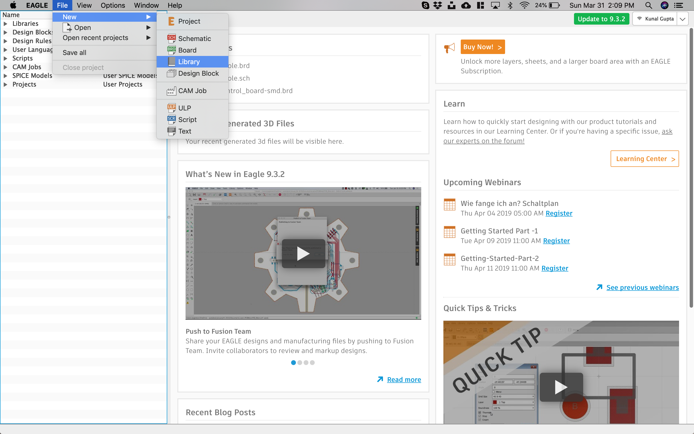

2. Go to `Library -> Manage Package` and name this new package UCSD_LOGO, then press OK.

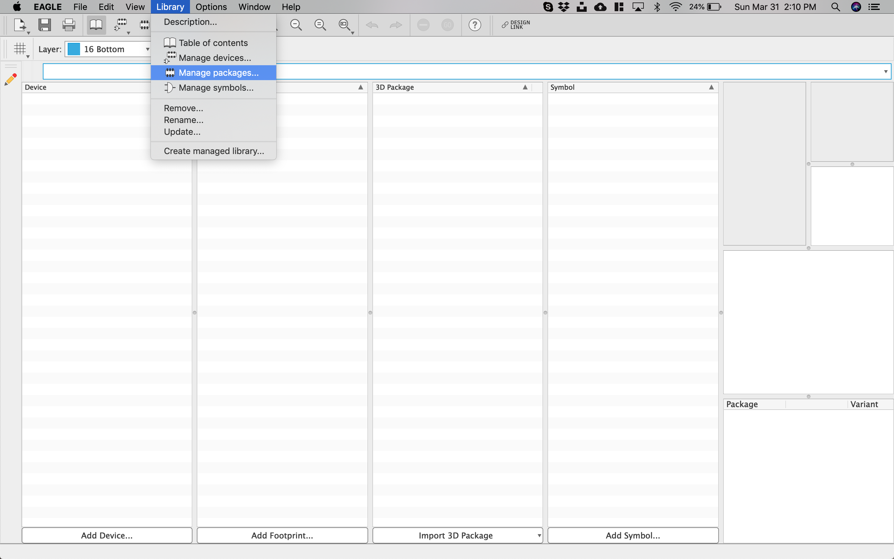

3. A new blank page will appear. Go then to `File->Run UPL...` and open the script named `import-bmp.upl`.

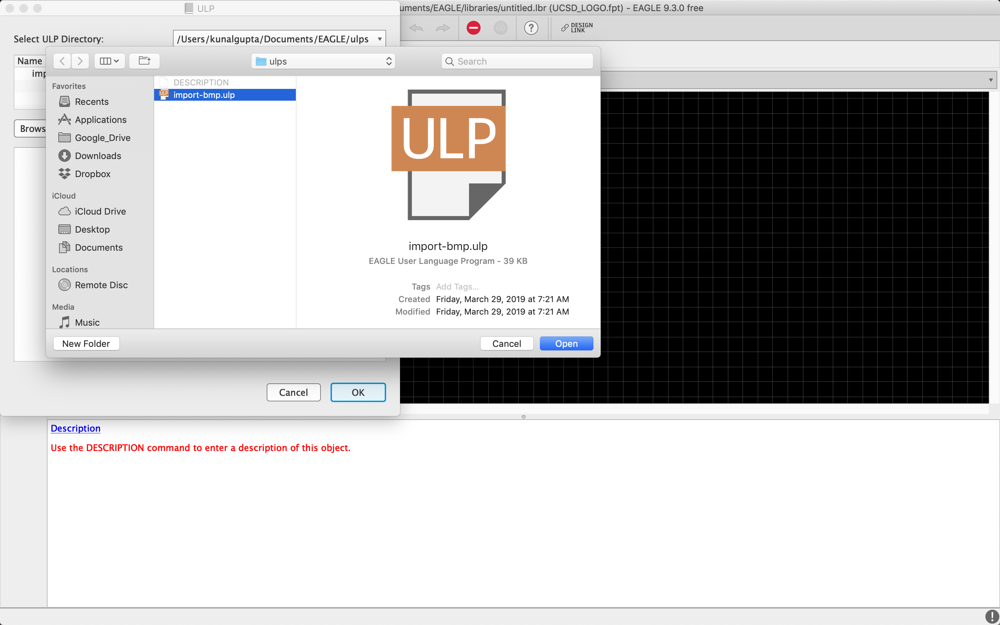

4. After this, a new message will appear. Press OK. Then search for the bmp image you want to transfer, in this case, we will transfer the UCSD logo. It is recommended that you change the image format to "Monochrome bmp" this means that the image will only have two colors, black and white. You can find the UCSD logo in your GitHub eagle-intro repository with the filename of `UCSD-logos-horizontal.bmp`.

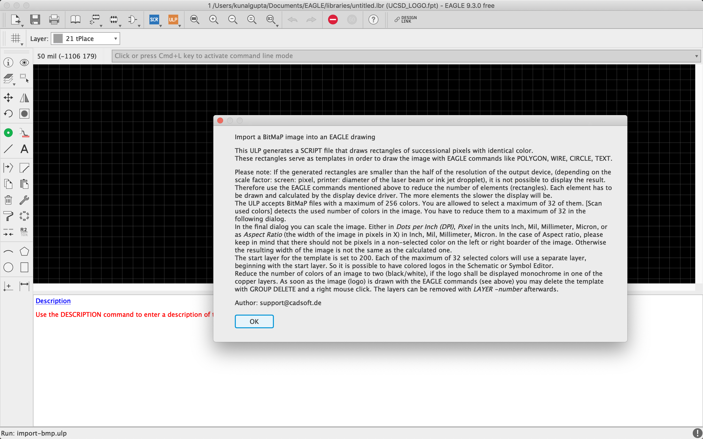

5. After selecting the UCSD Logo you will need to choose which color pixels to transfer. For this case select only Black.

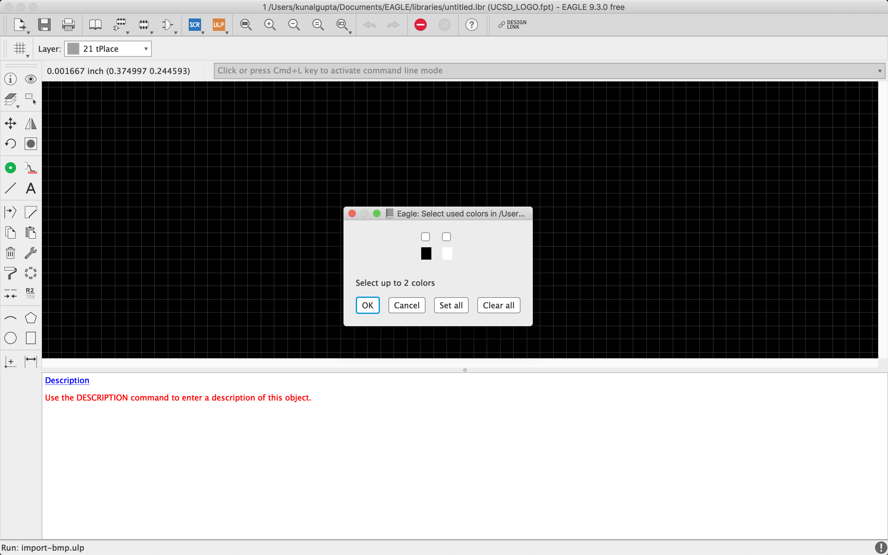

6. Then select the scale and layer of the image to transfer. For this image use the following parameters.

Format: Scaled

Unit: Mil

Scale: 0.5

Layer: 21

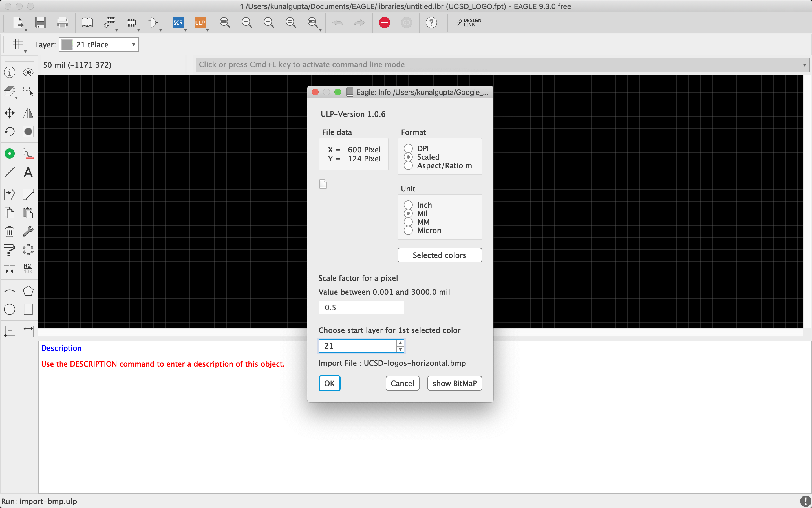

7. Select OK, after this a new window will appear, for that windows select `Run script`.

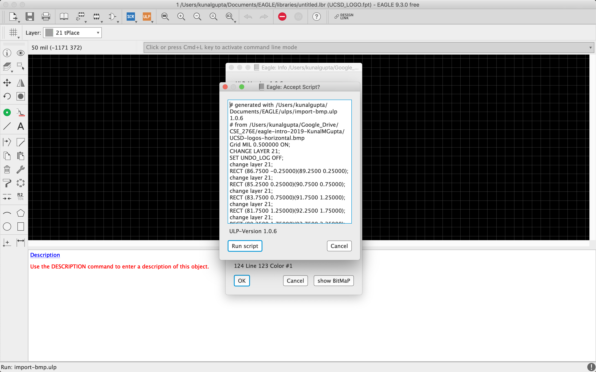
![image:https://lh3.googleusercontent.com/YcdkkNKLKyJf67RqU08ilv-10IL8KpCXNO1J4E0Z_Hy3fwpQgy9Nw7ImLgUAhKLY]

8. Now the image should be transferred. 

You will notice some text below the image, this is the path of the image. Zoom to it and delete it.

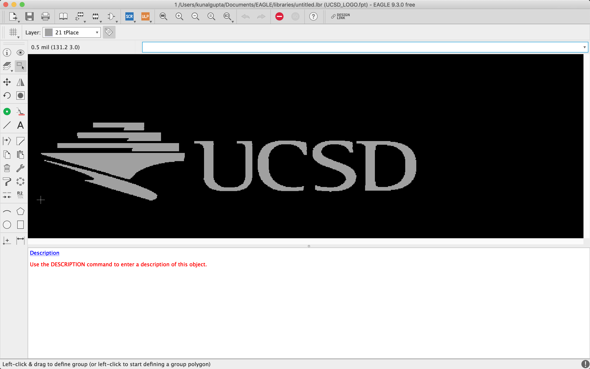

9. Save the library as Logos.lbr (if you are using an existing library just click save).

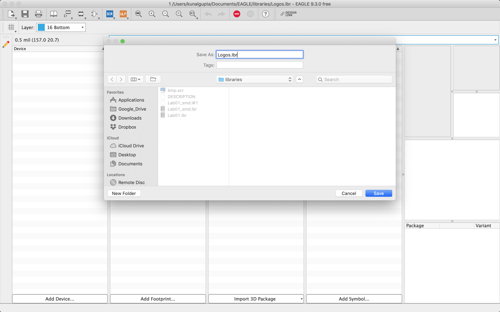

10. Click on the ``Add Part`` on the left and select ``Logos.lbr``.
<!--
Now open the Button-and-Light schematic and select `Library-> use`. After this search and open the library Logos.lbr or the library where you saved the logo.
-->
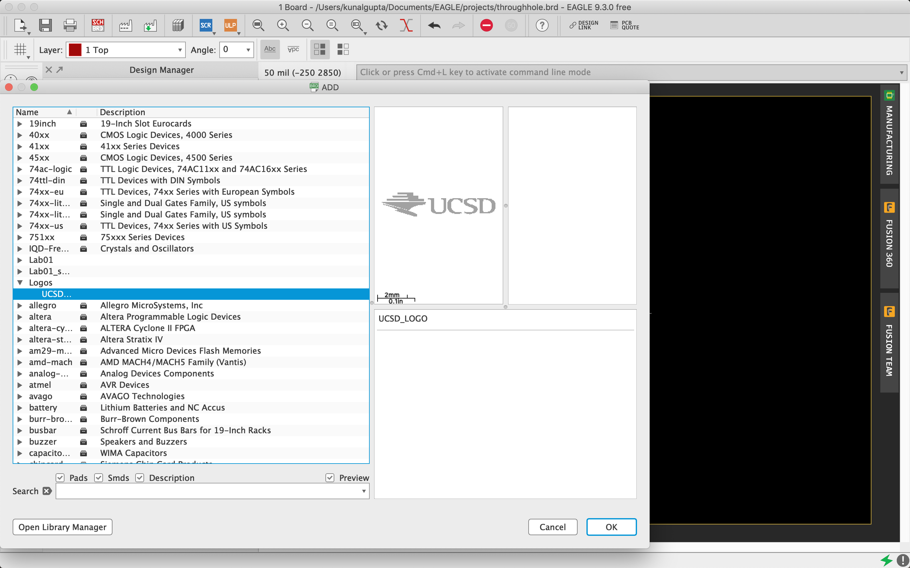

<!--
11. Select “Add” for adding an element and search for the UCSD_LOGO.
-->
11. Select OK and finally, you should see the UCSD logo on the board
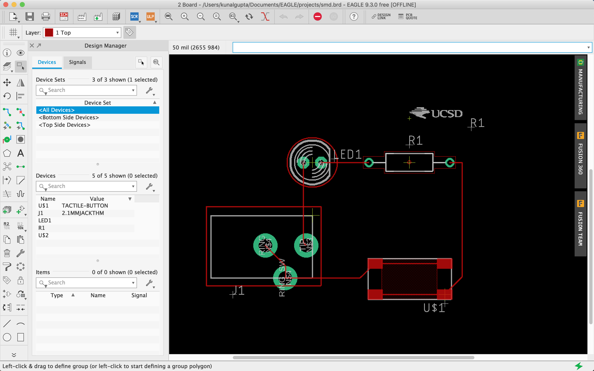

<!--
12. Select OK and finally, you should see the UCSD logo on the board.

-->

### Exporting Files
Once you've finished creating your boards and schematics, the last step is to export these files locally to commit to GitHub or send to others for review. Start by opening your schematic or board, then navigate to `File->Export`:

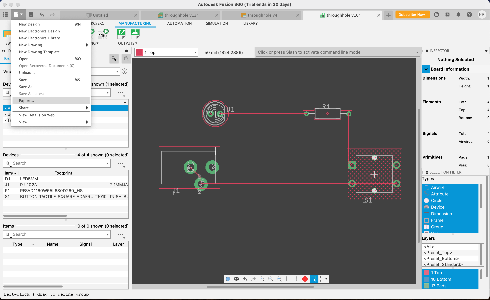

This will open a file dialog for saving your schematic as either a `*.fsch` or `*.sch`, or your board as either a `*.fbrd` or `*.brd`. For both files, save them using the "Eagle 9.X Compatible" format as shown below:

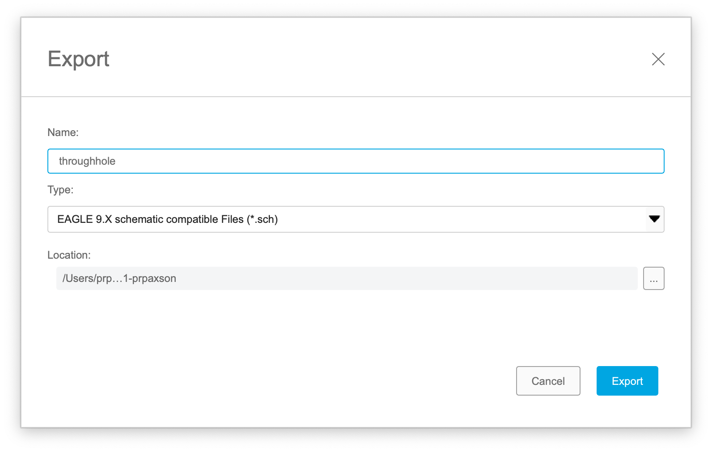

Fusion wants to name your files with a version number (e.g, `v1`) on the end.  Please delete this.  The Eaglint autograder won't recognize them.

Now you're ready to submit!

## Turn in Your Work
	
Submit your work via eaglint ( [http://eaglint.nvsl.io](http://www.google.com/url?q=http%3A%2F%2Feaglint.nvsl.io&amp;sa=D&amp;sntz=1&amp;usg=AFQjCNHn3w8dj3XknIOpuPo6FRKP_dkpng) ) and commit all the files list below files to GitHub. Make sure everything is committed to github and visible online. 

Also, create a GitHub Tag for your repository once you’ve done the final commits. Enter this detail in the eaglint submission under “Tag”.

### Rubric

“Perfect” score: 10

Initial points: 15

Checklist:

1. The schematic, board, and CAM files for your through-hole design ( `throughhole.sch, throughhole.brd, throughhole.cam.zip` ). With the artwork.
2. The schematic, board, and CAM files for your surface mount design ( `smd.sch, smd.brd, smd.cam.zip` ).
3. Your modified version of `Lab01.lbr, i.e, Lab01_smd.lbr.`
4. Your `lbr/Logos.lbr`.
5. Your `responsibility.pdf`.
6. Pour `survey.pdf`

You will lose one point for each day late your solution is and one point for each rejected submission to eaglint.  Note that the maximum possible points in 10, but you get start out with 15.  This lets you submit a few full checks to get used to what eaglint is expecting.

