# Arduino, Wireless, and Quadcopter Hardware

This is big lab, but there shouldn’t be many surprises. You’re mostly getting parts and pieces together for future labs, but you do have to integrate everything into one app at the end, and integration is always harder than you think.  
There’s a lot to do. Get started!

## Pick your Team

You will work on this lab and all future labs in teams of two. You will need to create a team on Eaglint and via the github classroom interface. The name of your team in github classroom must match the team name you use in Eaglint, or Eaglint will refuse to check your work.

## Skills to Learn

1. Installing the Arduino GUI.
2. Programming your remote and the flight control board.
3. Communicating with the boards using an FTDI serial port.
4. Communicate wirelessly between the remote and the FCB.
5. Reading values from the controller gimbals.
6. Use the other features of the remote.
7. Driving a DC motor with PWM.

## Equipment, Supplies, and Software You Will Need

1. Create a team in eaglint. You _must_ do this before clicking the starter link below.
2. The starter repo for this lab: https://classroom.github.com/a/a_OCsamt.
4. Test stand and remote control part kit.
5. Laser-cut parts for a test stand and airframe.
6. 1 micro USB cable.
7. 1 flight control board (FCB).
8. Three LiPo batteries.
9. 1 set of motors.
10. 1 set of matched propellers (2xCW, 2xCCW)

### Your Remote Control

You are responsible for the care of the remote:

1. If you break it, you'll need to pay replace the broken parts.
2. Be reasonably gentle with the gimbals (joysticks). They are of high quality, but are not indestructible.

Unfortunately, you cannot keep the remote. However, it is pretty easy to build you own. Ask the professor, if you are interested.

### Your Flight Control Board and Test Stand

The flight control board (FCB) is a PCB very similar to the quadcopter
you will eventually build. It mounts to the test stand and will
provide a platform for your initial quadcopter firmware development.
The FCBs are provided for your use during the class.

## Preliminaries

### Install Arduino

Install Arduino 2.3.3. This is the only version we will be supporting in class.  
[Arduino Download](https://www.arduino.cc/en/software)

### Setup Your Firmware Development Environment

The repo you create and use for this lab will be the repository you use for your software development during the rest of the class. The `firmware` directory is organized as an Arduino Sketchbook, which means the Arduino toolchain and IDE know where to look for things. To use it, you’ll need to set that directory as your sketch book directory in Arduino.  
(`File->Preferences->Sketchbook location`).  
Then, enter your github repo firmware folder path, example: `../<github_repo>/firmware`

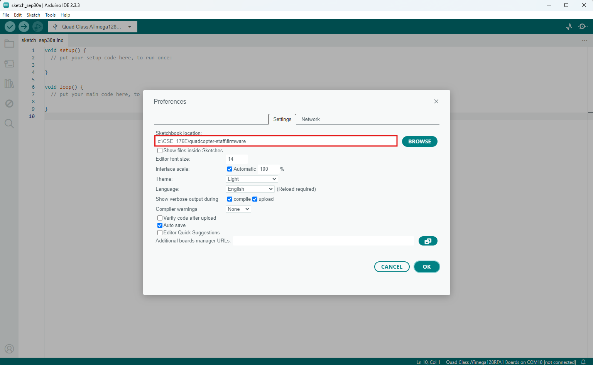

#### Add Board Definition Files

This will let Arduino talk to all the [Atmega128RFA](https://www.digikey.com/en/products/detail/microchip-technology/ATMEGA128RFA1-ZU/2208800) boards we will be using in this class, including your quadcopter.

- Clone the Arduino addon (https://github.com/NVSL/QuadClass_Atmega128RFA_Arduino_Addon) into `firmware/hardware`. You should end up with this directory `firmware/hardware/QuadClass_Atmega128RFA_Arduino_Addon/avr`.
- Restart Arduino. Then, under `Tool->Board` you should see `Quad Class ATmega128RFA1 Boards`. Select that board.
  
- Select `Tools->Programmer->USBTinyISP`

#### Install the Libraries

You’ll need a few libraries, so you might as well install them now, but you won’t use all of them in this lab:

Clone them into `firmware/libraries`.

1. Attitude, Heading, and Reference System (AHRS): https://github.com/NVSL/QuadClass_AHRS.git
2. LSM6DSOX library: https://github.com/NVSL/QuadClass-LSM6DSOX.git
3. Adafruit unified sensor library: https://github.com/NVSL/QuadClass_Sensor.git
4. Sparkfun SerLCD library: https://github.com/sparkfun/SparkFun_SerLCD_Arduino_Library.git

Here's the command sequence on my machine:

```
(cd ./firmware/libraries/; git clone git@github.com:NVSL/QuadClass-AHRS.git)
(cd ./firmware/libraries/; git clone git@github.com:NVSL/QuadClass-LSM6DSOX.git)
(cd ./firmware/libraries/; git clone git@github.com:NVSL/QuadClass-Sensor.git)
(cd ./firmware/libraries/; git clone git@github.com:sparkfun/SparkFun_SerLCD_Arduino_Library.git)
(cd ./firmware/hardware/;  git clone git@github.com:NVSL/QuadClass-Atmega128RFA-Arduino-Addon.git)
```

Go to Library Manager and install "Adafruit LSM6DS". A pop-up window will show up, click "Install ALL".  
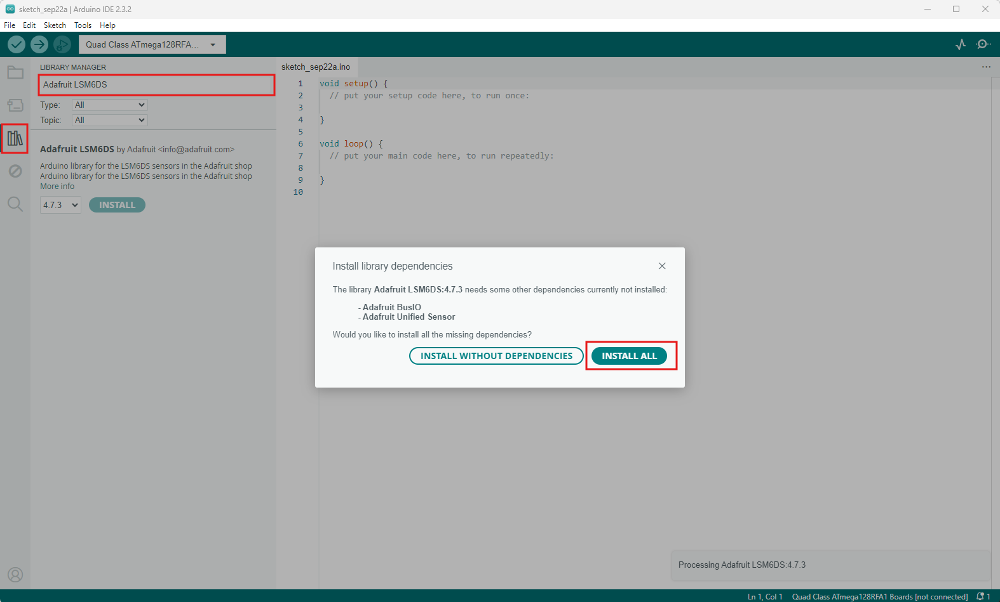


When you're done, the top few levels of your repo should look like this:


```
./firmware
./firmware/hardware
./firmware/hardware/QuadClass-Atmega128RFA-Arduino-Addon
./firmware/RFEcho
./firmware/RFEcho/RFEcho.ino
./firmware/RFChat
./firmware/RFChat/RFChat.ino
./firmware/libraries
./firmware/libraries/Radio
./firmware/libraries/SparkFun_SerLCD_Arduino_Library
./firmware/libraries/RotaryEncoder
./firmware/libraries/QuadClass-Sensor
./firmware/libraries/QuadClass-AHRS
./firmware/libraries/QuadClass-LSM6DSOX
./firmware/libraries/Adafruit_BusIO
./firmware/libraries/Adafruit_LSM6DS
./firmware/libraries/Adafruit_Unified_Sensor
./firmware/libraries/Remote
./firmware/libraries/SoftwareSerial2
./firmware/RFCount
./firmware/RFCount/RFCount.ino
./hardware
```

Restart Arduino and the bottom of your `Sketch->Include Library` menu should look something like this:

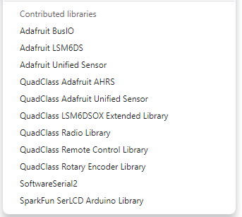

#### Getting Updates For the Starter Repo

Occasionally, I find bugs in the starter repo and push updates to it. To get them you need to 'fetch from upstream' using git. The first time you do this you need to do:

`git remote add upstream git@github.com:UCSD-Quadcopter-Class/QuadClass-Quadcopter-Starter-sp23.git`

Then, each time I push a new update you should do this:

```
git fetch upstream
git merge remotes/upstream/master
git push
```

I'll announce pushes on Piazza.

#### Create Your Firmware Source Files

Create sketches for your quad and remote control firmware.

- `firmware/quad_firmware/quad_firmware.ino` will hold the firmware (i.e., flight control software) for your quadcopter
- `firmware/remote_firmware/remote_firmware.ino` will hold the code for your remote control.

Add the following code to `remote_firmware.ino`:

```
#include <radio.h>
#include "quad_remote.h"      // Header file with pin definitions and setup
#include <serLCD.h>
serLCD lcd;

void setup() {
}

void loop() {
}
```

### Arduino Troubleshooting

Programming Arduino microcontrollers (i.e., transfering the compiled to the device) can be a temperamental process. If you get an error while programming the board, there are many different things you can try to make it work (some of which seem like magic):

- Make sure you have the right board and programmer selected.
  - On a Mac, this will be something like `/dev/cu.usbserial-AG0JL8H4`. It is definitely not anything like `tty.usbserial-AG0JL8H4` or `cu.Bluetooth-Incoming-Port` or `cu.iPhone-WirelessiAPv2`.
  - On a PC, it is probably the highest-numbered "COM" port.
- Try a different USB port. Laptops generally have multiple, internal USB hubs and some don’t play well with Arduino.
- Try a USB 2.0 port. Sometimes programming doesn’t work over USB 3.0. If your computer has a USB 2.0 hub use it. If not, get a USB 2.0 hub and plug the Arduino into that. On some machines the blue USB ports are 3.0 and black ones are 2.0.
- Unplug everything, quit Arduino, plug everything back in, restart Arduino.
- Google the error. Chances are you are not alone.

In rare cases, you may need to install drivers for the FTDI programming board. Read the How to Install FTDI Drivers Tutorial https://learn.sparkfun.com/tutorials/how-to-install-ftdi-drivers.

## Bringing Up the Remote

Your first task to "bring up" your remote. This means verifying that all of it's components work and that you can successfully access them via software.

**Note:** You don't need to assemble it anymore, we will provide an assembled remotes.
### Assembling the Remote

Many of you will receive a partially assembled remote. Follow along in here to add the parts that are missing.

**The pictures below are for an older model of the remote. The steps are very similar. Differences are noted.**

To assemble the remote you will need the following **FIXME CHECK**:

- 8x 1-inch standoffs
- 4x 1/2-inch standoffs
- 4x 3/8-inch standoffs
- 8x 1-1/2-inch screws
- 4x 1-1/4-inch screws
- 12x nuts
- 4x small zip ties
- 1x PCB
- 1x LCD
- 1x battery cable
- 2x gimbals
- 1x USB Micro cable

##### Steps

**All the Parts**

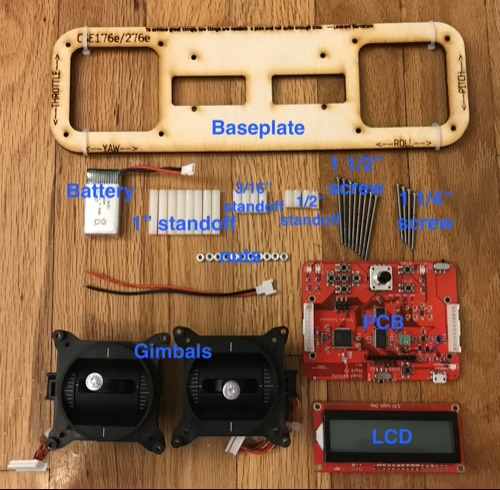

**Add Screws**

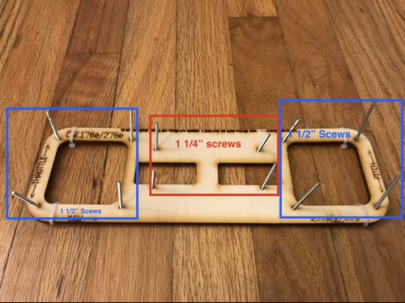

**Add Standoffs**

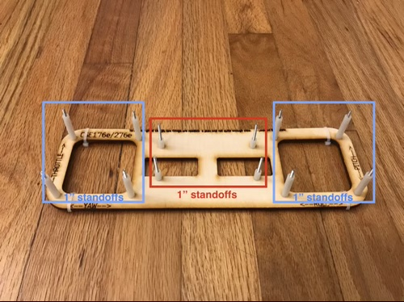

**Add Gimbals and PCB**

The vertical axis of the left gimbal should not return to the center position automatically. The other gimbal axes will.

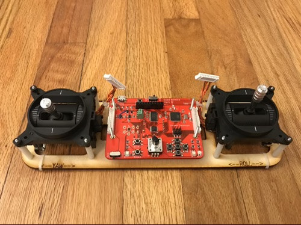

**Screw in the Gimbals**

THe pictures shows nuts on the screws attaching the gimbals, but we don't use those any more. Instead, the screws should thread directly into the black plastic of gimbal. If they don't go easily, come see the TA or teacher, we may need to add threads to holes. Also, do not over-tighten the screws -- the plastic is quite soft.

**Plug in Gimbals**

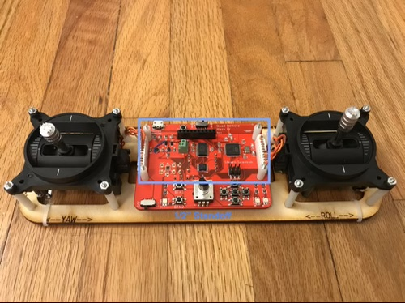

**Install Standoffs, LCD Nuts, and LCD**

The pictures show the nuts going _over_ the LCD, but they should actually go under. This makes it much easier to remove the LCD if you needed.

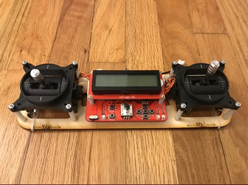

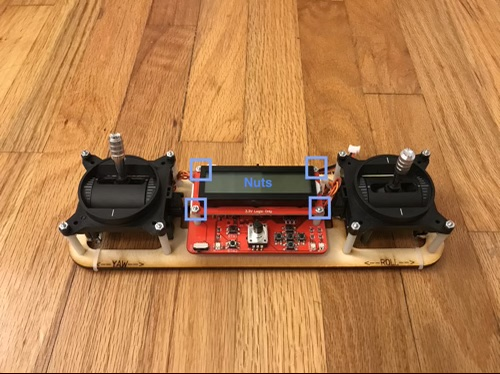

**Attach Zip ties as 'feet'**

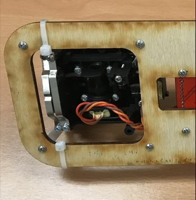

### Installing a Battery

The remote can be powered either via USB or via a LiPo battery. It also has a builtin LiPo charger that will charge the battery when it's attached to USB. You'll have three batteries. Keep one charging on the remote and the other hooked to the FCB.

There two typese of connectors for the battery: white and green.

For the white connector, you can plug the battery directly into the connector.

For the green connector, you'll need connecta a "pig tail" to the green terminal block on the PCB.

Once that's done, you can plug the battery in by inserting the plug into the white connector.

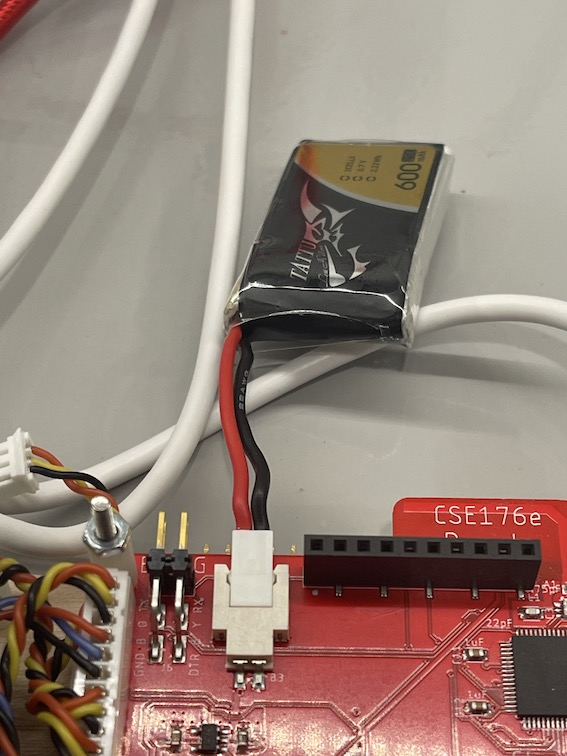

The wooden base of the remote has cutout to accomodate a battery. Apply a piece of _fuzzy_ velcro to the to the PCB under that gap (if there's not one already)

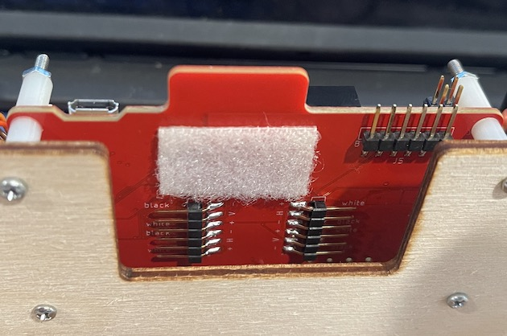

and attach the battery:

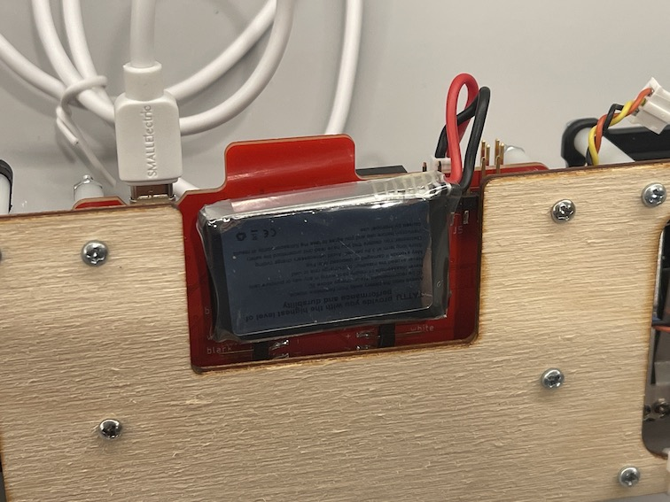

You may need to put velcro on the battery as well. If so, make sure to use the rough velco and make sure the velcro is oriented like this (note the position of the wire coming off the upper-right corner):

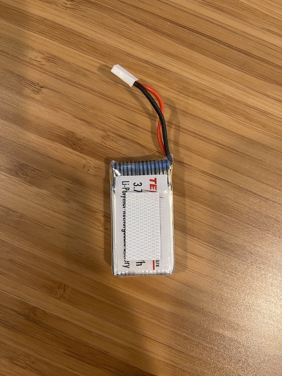

### Run a Test Program On the Remote

The Remote has a builtin USB-to-serial converter that allows it to program the microcontroller on the remote. It can also program the FCB via a cable. Whether it will program the remote or the quadcopter target is controlled by the `quad/RC` switch at the top of the remote.

Plug your USB cable into your laptop and the remote, and make sure you're Board, Port, and Programmer are set correctly:

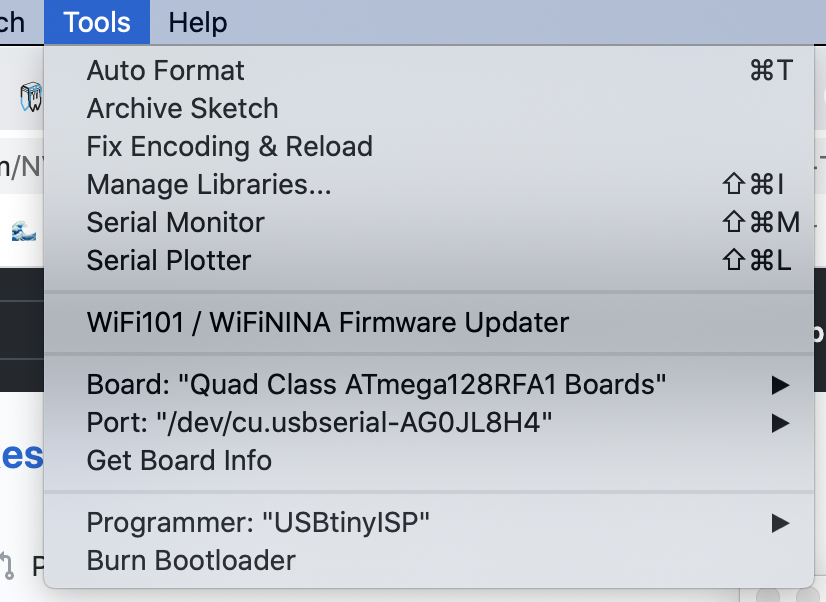

Then...

- Set the "RC/Quad switch" located on the Remote Control board to 'RC'

- Open up `File->Examples->01.Basics->Blink`.

- Compile and download to the remote.

- One of the LEDs on the board will start blinking slowly.

- Open up `File->Examples->01.Basics->AnalogReadSerial`, and run it.

- Then, open `Tools->Serial Monitor`. You should find it printing a number at you. Moving the left stick on your remote should cause it to change.

- For fun, close the serial monitor, then `Tools->Serial Plotter` and you should be able to draw curvy lives by moving the left joystick.

### Reading the Buttons

The `QuadClass Remote Library` library provides access to the basic hardware features of the remote. You get access to the library with `#include "quad_remote.h"` and calling `quad_remote_setup()` in your Arduino `setup()` function.

The library provides a call-back-based mechanism for detecting when the user presses the buttons. Function pointers (e.g, `btn1_cb`) hold functions that will be called when a button (e.g., button 1) is pressed or released. The callbacks you set need to run quickly (e.g., ideally, they should not print anything to the serial port).

To see how it works open `Open->Examples->QuadClass Remote Control Library->knob_and_buttons.ino`. Run it,
open the serial monitor, push some buttons, and see what happens.

There is also a simple 'is_pressed()' function that you can use to tell if a given button is currently pressed. You should pass the `*_PIN` constant for the button you want to test. The `*_PIN` macros are in `quad-remote.h`.

Read the code to understand how it works.

### Reading the Knob

There's a similar mechanism for the knob. The library defines an object called `knob1`, and calls a callback (`knobs_update_cb`) when it's value might have changed (i.e., sometimes it'll be called even though the value remains the same). This funtion needs to run very quickly (e.g., it should not write anything to the serial port), otherwise you might miss some movement of the knob.

You can access the current value of the knob with `knob1.getCurrentPos()`. The knob can turn indefinitely in either direction and the number will grow and shrink accordingly. You can also set the current knob value with `knob1->setCurrentPos()` (see `knob_pressed()` in the example).

Look at `Open->Examples->Remote->knob_and_buttons.ino` and the `libraries/RotaryEncoder/RotaryEncoder.h` for details (Don't bother with `RotaryEncoder` example. It's broken and `knob_and_buttons.ino` is more useful). Run the example and turn the knob. The knob has a builtin button, too. It works just like the other buttons.

### Writing to the LCD

The remote has a fancy LCD screen with an RGB LED backlight (it's this: https://www.sparkfun.com/products/16397).

The `Remote` library sets up the lcd for you as an object called `lcd`.

The `knobs_and_buttons.ino` example shows how to use it: It displays the value of the knob and lets you move it's location around on the display. It's pretty faint because it's redrawing so quickly but it should be visible.

Here are the basic commands.

- `lcd.clear()` clears the display
- `lcd.home()` move the cursor to the top left position.
- `lcd.print(char *)` write some text to the display. It works with `int`, `float`, `char *`, etc.
- `lcd.setCursor(int c, int r)` Move the cursor to the `c` position of row `r`.

There's some other fancy stuff you can do, too, like scrolling, changing the contrast setting, and changing the backlight color. Checkout the examples, but note that the examples all assume I2C connectivity, but the remote uses `SoftwareSerial`, so you'll have to adapt/copy from the examples rather than running them directly.

### Reading the Gimbals

1. Write a function that reads values from the gimbals and use it to writes them to the serial port.
   - Check out [analogRead()](https://www.arduino.cc/reference/en/language/functions/analog-io/analogread/).
   - The [Arduino Serial monitor](https://www.arduino.cc/reference/en/language/functions/communication/serial/) will tell you how to get output to the serial port.
   - The function should go in your `firmware/remote_firmware/remote_firmware.ino`, which will slowly grow into your remote’s firmware.
2. Does the value you read from the gimbals vary across the gimbals’ full range of motion? If not, let us know.
3. Have your code scale the values you get from the gimbals so the full range of motion corresponds to the range 0-255. Arduino's `map()` and `constrain()` functions are useful here.

### Reading the Battery Voltage

Write a small function that uses `analogRead(BAT_SENSE_PIN)` to read the battery voltage, where `BAT_SENSE_PIN = A7`. Inside that function also print the battery voltage using `Serial.print()`.

In the setup function set the voltage reference as INTERNAL, `analogReference(INTERNAL);`, and the pin mode of `BAT_SENSE_PIN` as input. Remember also to properly configure the Serial.

Call the function inside the main loop with a reasonable delay. Check that the integer number (battery voltage) drops over time.

## Assemble your Test Stand

Parts:

- 1x FCB
- 1x Air frame
- 8x small wooden spacers
- 4x 1/2-inch (or 5/8th) screws
- 4x nuts
- 1 set of motors
- 4x small white zip ties
- 2x skewer
- 1x battery
- 2x test stand sides
- 1x test stand cross-brace
- 1x 4-pin programming cable
- 2x Clockwise Blades
- 2x Counter-clockwise Blades
- 4x blade guards

### Assemble the Frame

The test stand assembles without any tools, and should look like this when it's done:

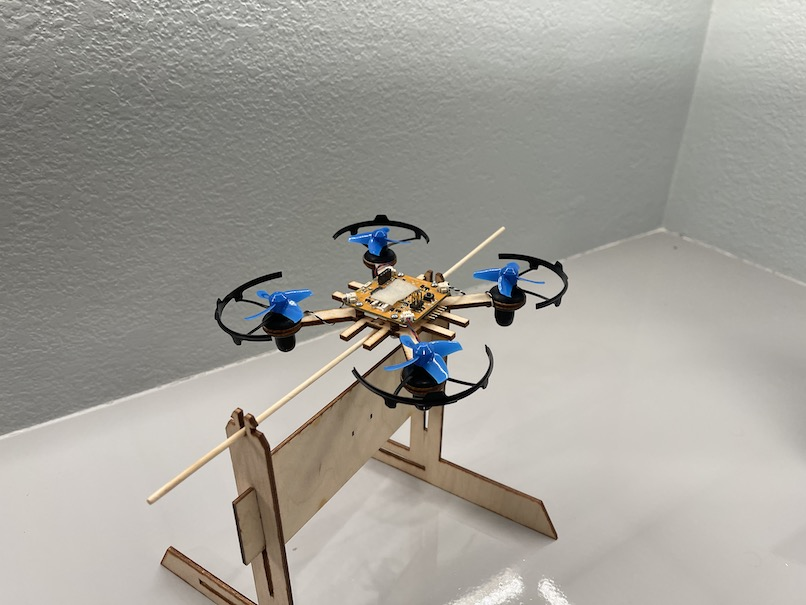

1. The middle brace slides into the slots on the two end pieces. You can use either the vertical or horizontal slot.
2. The wooden dowel goes through the holes
3. You can attach two small zip ties to the down to keep it from sliding too much.

It's easy to disassemble as well, although the corners are a bit sharp.

**Note:** You don't need to assemble the FCB anymore, we will provide an assembled FCB.

### Assemble the FCB and Airframe

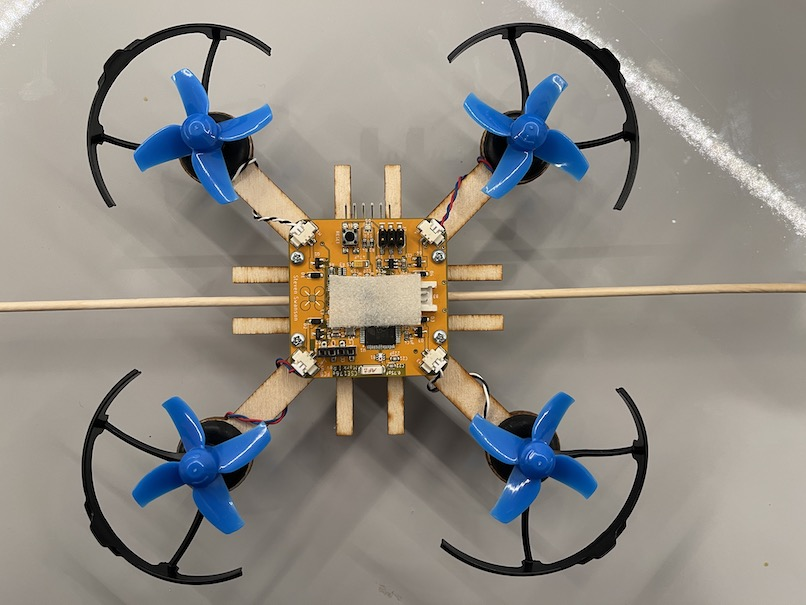

The FCB mounts to the wooden air frame as shown above by following the steps below:

1. Use four screws and nuts to attach the FCB to the airframe. Use 2 of the wood spacers on each screw to provide a gap between the two. The photo shows a single space, but you will need 2.

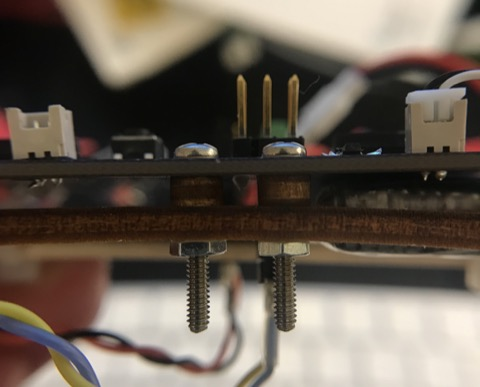

2. Use another four zip ties to attach two of your dowels to the air frame to the dowel. One dowel should go above the air frame the other goes below. They should be snug but not super tight. They need to hold it securely. You should be able to move the dowel back and forth with some friction.

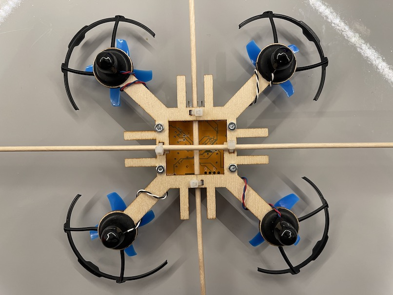

3. Trim the tails of your zip ties as short as you can. Nail clippers work well.

4. Put a piece of _fuzzy_ velcro on the top of the FCB as seen above.

5. Plug a battery into the connector on the top of the board. If the battery doesn't have velcro, add _scratchy_ velcro to the battery as described for the remote. Mount the battery on FCB.

6. The motors plug into the four recepticals on the FCB. You need two read/blue and two black/white motors and matching colors need to diagonally opposite eachother (like in the picture above). It's hard to see but there is "RB" on the corner next to the connectors for the red/blue wires and "BW" next to the connectors for the black/white wires.

7. Insert 4 rubber grommets into the holes at the end of each arm. Work carefully so you don't break your airframe. It takes some effort.

8. Wrap the wire around the arms once or twice and then insert the motor through the grommet. It is a tight fit.

9. Install the four propellers. You need two clockwise and two counter-clockwise motors. The clockwise props go on the red/blue-wired motors. The counter-clockwise props go on the black/white-wired motors. See note below about identifying clockwise vs counter-clockwise props.

10. Install the four motor covers on the bottoms of the motors. This will give the quadcopter 4 rubber "feet".

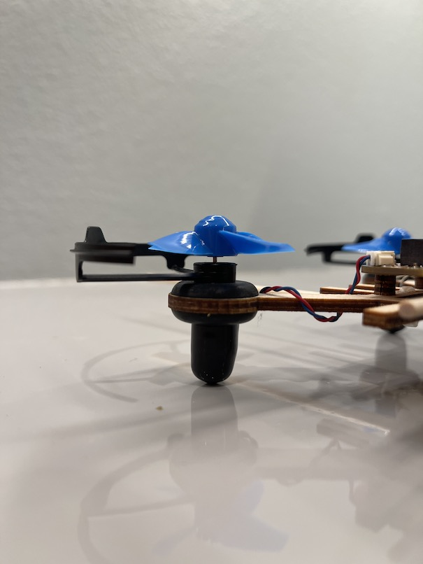
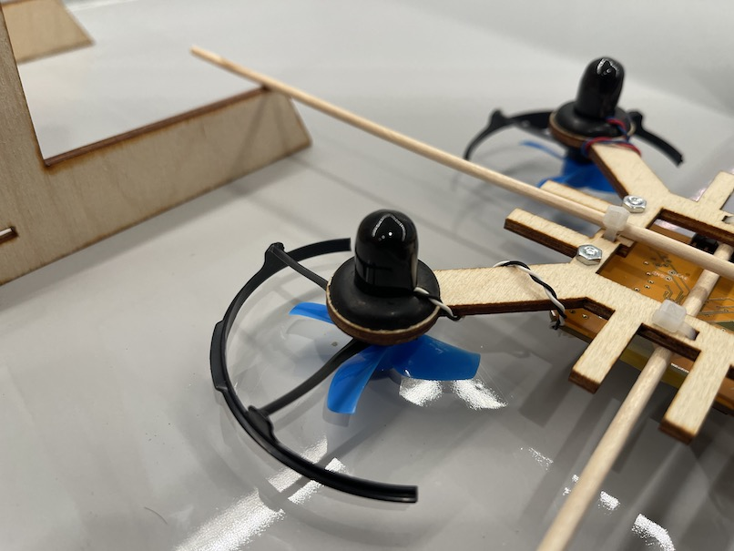

#### Identifying Props

We have two different styles of props. The first have two long, slender blades. The clockwise props are labeled labeled "A" (see below) and the counter-clockwise props are labeled 'B'.

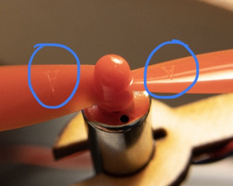
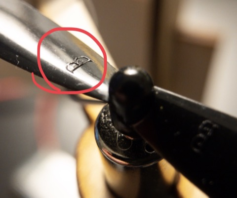

The second type of prop are smaller and have four wider blades. They have arrows on them showing the direction they spin.

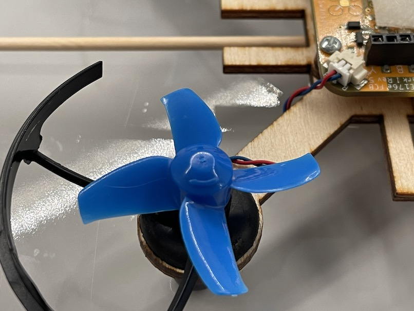
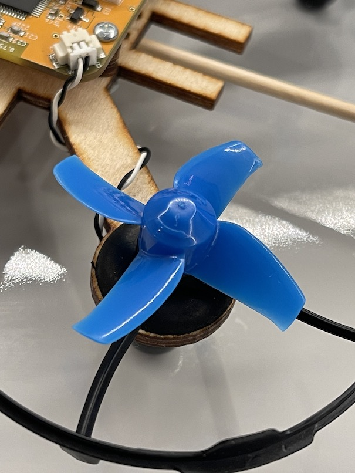

#### Removing Props

Getting the props off can be hard. You have a little lever tool in your kit to help with this:

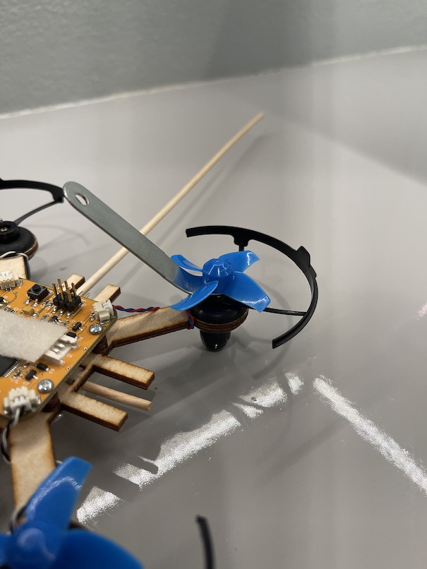

## Bringing up the FCB

The FCB has three key hardware components you'll need to test: The microcontroller, the accelerometer, and the motors.

### Turning on the FCB

To turn the FCB on you need to first connect the battery to the FCB and the then move the switch in the FCB from OFF to ON.

### Flashing the Bootloader

Flashing the bootloader is a step you typically performance once after a board is manufactured. It installs a small piece of software that makes the board compatible with Arduino.  You'll need to do this with your quadcopters when they are manufactured. We are doing it here for practice.

[Flashing the bootloader and bringing your board up](https://github.com/NVSL/QuadClass-Resources/blob/master/labs/Assembling-A-PCB/Flashing-The-Bootloader.md)

### Run a Test Program on the FCB

The FCB can be programmed via the remote control's USB-to-serial converter. The colorful 4-strand cable is for this purpose. The 2x2 female end connects to the remote. The 1x4 male end connects to the FCB. The pins on both boards are labeled by color ('G', 'B', 'O', 'Y'). It can connect to the FCB from either top or the bottom.

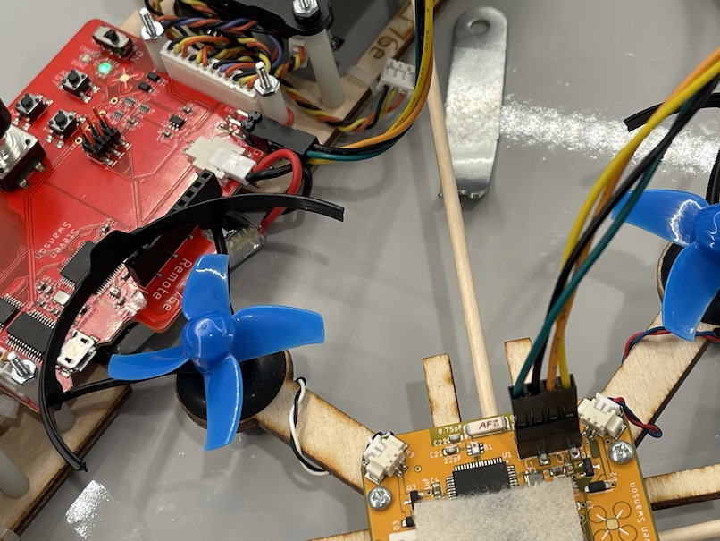

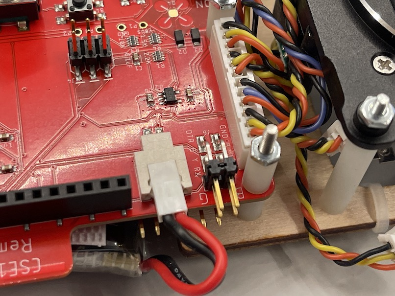

- Set the `RC/Quad` switch to "QUAD".
- Run the `Blink` example. The light should blink.
- Run the `AnalogReadSerial` example. It will print at you, but the number won't change.

### Reading from the IMU

Load, compile, and run `Open->Examples->QuadClass LSM9D6SOX Extended Library->quadclass_lsmd6sox` on the FCB. Open the serial monitor (You will probably need to adjust the BAUD rate to 115200 using the menu in the top right corner), and you should see something like this:


Shows the raw sensor readings from your IMU. As you move the FCB, they should respond accordingly. See if you can find gravity. It's 9.8 m/s^2.

### Driving the Motors

The motors on the FCB are attached to pins 8, 3, 4, and 5.

Add some code to `firmware/quad_firmware/quad_firmware.ino` to control the speed of the motors, and use the functions to run the motors at different speeds. [analog_write()](https://www.arduino.cc/reference/en/language/functions/analog-io/analogwrite/) will be useful.

To avoid injury take the following precautions

1.  Be careful of the propellers on the motors. They can hurt you.
2.  Before you start, make sure the airframe is in the “locked” position. This means mounting it on the test frame and sliding the stubby arms into the slots on the sides of the test stand, like this:

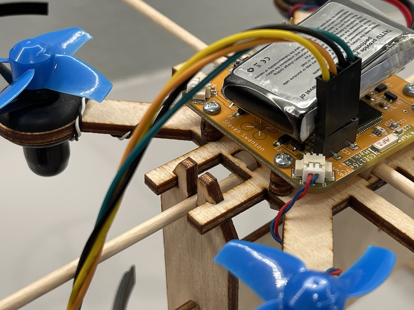

#### If Your Motors Spin the Wrong Way

Some of the motors we purchased are wired backwards: The Red-Blue motors and the Black-White motors spin in the same direction. To fix this, you can use a pin to gently lift up the white tabs on the motor plug to remove the wires and the reinsert them. Here's a video showing how: https://youtu.be/G3APCQteYaQ.

## Using the Radio

**Note:** In your `setup()` function, you should call `rfBegin()` after you
call `quad_remote_setup()`, otherwise things won't work.

The microcontroller on the remote and the FCB (and eventually your
quadcopter) has a built-in radio. We will use it to send commands
from the remote to the FCB and to return telemetry.

First, find out your groups assigned channel. You'll need to edit the
examples below to pass a channel number to `rfBegin()`. Eaglint will
assign you a channel number. It's at the top of your list of group
design checks.

To test the wireless, open `firmware/RFCount/RFEcho.ino` and run it on
your FCB.

Then run `firmware/RFChat/RFChat.ino` on your remote. Open the serial
monitor, set the BAUD rate to 9600 (while it's connected to the remote) and type some text into the field at the top, and hit return.
It'll bounce the data off the FCB and print out the result. You might
get some garbage too, don't worry about it.

Look at the `RFChat` code to understand how it works: It checks if
data is available from the radio and writes it to the serial
port. Then, it reads data from the serial port and writes it to the
radio. Note that it sends and recevies multi-byte packets.

You'll notice that the radio library blinks one of the LEDs when data is sent or received.

## Sending Useful Data

Your next task is to think about how you will transmit data from your
remote to the quadcopter. A reasonable approach is to create a `struct`
that holds all the control values you want to send to the
teststand/quadcopter and transmit that struct, using `rfWrite()`. You
should include the gimbal values and the buttons.

There are some caveats:

First, you must tolerate the fact that the the radio channel you are using is a shared resource (it's the same RF range as WiFi). This means you may pick up data that is not yours, so you must be able to tell which packets are meant for you and which aren't.

One way to do this is to include a “magic number” in your command struct so
you can make sure you are getting commands from your remote and not
some other random data or packets from another team or noise. If you want to be more careful, you can include
a checksum as well. For instance, the last entry in the struct could
hold the `XOR` of all the other words in the struct. If they don’t
match, it’s a packet from somewhere else.

**Note:** If you receive a bad packet, you should called `rfFlush()` to make sure there's no unread data in the radio's buffers that will cause future calls to `rfRead()` to read misaligned data.

Second, don’t spam the world with your radio traffic. Modify your
remote firmware to send the command packet between 10 and 20 times per
second. The `millis()` functions (search for “arduino millis") will
help you here.

Third, your struct and the related function will be shared between
your quadcopter firmware and your remote firmware. The clever way to
do this is to create your own Arduino library that holds the struct
and related code. Otherwise, if you change it in one place, you’ll
have to remember to change it in another. This violates the [DRY
principle](https://en.wikipedia.org/wiki/Don%27t_repeat_yourself). Here's a tutorial on writing an Arduino library: https://www.arduino.cc/en/Hacking/libraryTutorial.  
Or you can look at the librarise in your repo for guidance (`firmware/libraries`).

To test it, program the test stand board to receive the data from your
remote and print it out. Verify that the values change as you move the
gimbals, etc.

### Reading the Battery Voltage on The FCB

Write a small function that uses `analogRead(BAT_SENSE_PIN)` to read the battery voltage, where `BAT_SENSE_PIN = A7`.

In the setup function set the voltage reference as `INTERNAL` with `analogReference(INTERNAL);`, and the pin mode of `BAT_SENSE_PIN` as `INPUT`.

The range of potential values returned from `analogRead()` is 0-1023.

The values you read from analogRead() are different based on battery level, so you'll have range of interger number that map the percentage of battery level. Also, remotes and quads have different value range.

You need to measure a value when the battery is empty, then measure a number when the battery is full, that's the range of the battery in interger number, than you need map that to percentage.

**Note:** The battery voltage level is not stable, sometime it will change in a wired curve, the value you measured is only the rough reference of the battery level. And there are also variance between different batteries.

### Blinking the LEDS

The FCB (Flight Controller Board) has eight LEDs. Four at the top (2 LEDs in each LED package), and four at the bottom.

The four LEDs at the top are addressed individually, and the software pin numbers are `LED1 = 16; LED2 = 17, LED3 = 18, LED4 = 36`. Write a function that turns on and off (blinks) these LEDs, choose any delay which makes the blinking visible (e.g., 1 second). Remember to set the pin mode of these LEDs as output.

The four LEDs at the bottom are addressed using a single pin which outputs PWM (Pulse Width Modulation). With PWM we can control the brightness of an LED. The software pin number is `PRETTY_LEDS = 34`. To write to this pin you need to use `analogWrite(PRETTY_LEDS, VALUE)`. Write a function that changes the brightness of the four LEDs using your preferred delay (e.g., 1 second). Remember to set the pin mode as output.

## Putting it All Together: Remote Controlled Motors and LEDs

Modify `firmware/quad_firmware/quad_firmware.ino` and
`firmware/remote_firmware/remote_firmware.ino` so you can arm your
FCB, calibrate your gimbals, and control your motors’ speed with the
remote.

### Calibrating Your Gimbals

The potentiometers in your gimbals are imperfect, so they need to be
calibrated. As you move them around, you'll notice that the values
don't go from 0 to 1023 (the full range of the microcontrollers ADC).
My yaw control, for intsance, only goes from 57 to 906. You'll need
the actual values for your gimbals so you can know, for instance,
where the neutral position for pitch, yaw, and roll are. To collect
these values, you'll need a calibration mode. The Arduino `map` functions is useful here.

A few things are required in your calibration mode:

1.  You don't have to do it every time your quadcopter restarts.

2.  You can't accidently enter it while your quadcopter is flying (since it requires you moving the sticks all over the place)

3.  The LCD should provide feedback about when calibration is in progress and when it's finished.

For #1, the Arduino EEPROM library is useful:
https://www.arduino.cc/en/Reference/EEPROM. It let's you store data
across resets.

For #2, you should only be able to enter calibration mode while the
quadcopter is not armed (see below). You will also need a way to
trigger calibration mode (e.g., pressing one of the buttons).

### Arming your FCB

The propellers are sharp enough and fast enough to hurt you. To
prevent accidents, your firmware should require you to "arm" your
quadcopter before it will turn on the motors.

Our arming sequence is to put the both gimbals in the lowest,
outermost position (left gimbal to lower-left, right gimbal to lower-right). This position is useful in two critical ways: 1)
the pilot is unlikely to do it by accident and 2) it ensures that the
throttle is at 0 when the quadcopter is initially armed.

Requirements:

1. Turn on the LED on the quadcopter when it is armed.
2. Provide feedback to the pilot (via the remote) that the quad is armed.
3. Make one of the remote buttons disarm the quad.
4. The quadcopter and remote must agree about when the quad is armed.

For #4: For instance, if your reset your
remote, the FCB should be disarmed. If you reset the FCB it should
disarm and remain disarmed until the remote arms it again. If you press the button to disarm, it should disarm the quad. If the remote turns off, the quad should disarm.

### Throttle Control

Once the FCB is armed, the throttle gimbal (the vertical axis of the left
stick) should control the speed of all four of your motors.

Make sure of the following:

1. When the stick is all the way down, the motor should turn off (I.e., writing 0 with `analogWrite()`).

2. When the stick is all the way up, you should be driving the motor at full power (i.e., writing 255 with `analogWrite()` )

3. As you move the stick, motor power should vary smoothly with the sticks position. (i.e., If the stick is at its midway paint, you should be writing 128).

4. If you push up on the stick when it is all the way up or down on the stick when it's all the way down, it shouldn’t behave strangely. Achieving this will require you to deal with non-idealness of the gimbals. The Arduino `constrain` function is useful here.

## Turn in Your Work

### Commit Your Code

1. Your remote firmware in `firmware/remote_firmware/remote_firmware.ino`.
2. Your quad firmware in `firmware/quad_firmware/quad_firmware.ino`.
3. Any other code you created (e.g., a library with your radio packet format).

Once you’ve committed everything, create a tag called “programming-the-hardware” Be sure to make it an “annotated” tag and push it to your repo (https://git-scm.com/book/en/v2/Git-Basics-Tagging). Verify that it is visible on github.

### Demo Your Code

1. Demo your remote controlled motors.
2. Complete the reflection for this lab: https://docs.google.com/forms/d/e/1FAIpQLSfB8XsDV8FtTZYO1mv3FZrd9mUs1hDlFvQxnfAK0K2zptTjxQ/viewform

### Rubric

Possible points: 10

Check list (-1 point for each missing item):

1.  No motor activity when disarmed.
2.  Motor control active when armed.
3.  User feedback on the remote when the quad is armed.
4.  Arming turns on FCB LED.
5.  FCB reset disarms.
6.  Remote reset disarms.
7.  Calibration works.
8.  Calibration values saved.
9.  Calibration mode unavailable when armed.
10. Calibration feedback on LCD.
11. Pushing sticks past calibrated values doesn't result in strange behavior.
12. Zero motor activity at 0 throttle.
13. Throttle smoothly controls motor output across full gimbal range.
14. Turning off remote disarms quad.
15. Battery measurement on the remote.
16. Battery measurement on the FCB.

You will lose one point for each day late your solution is.
